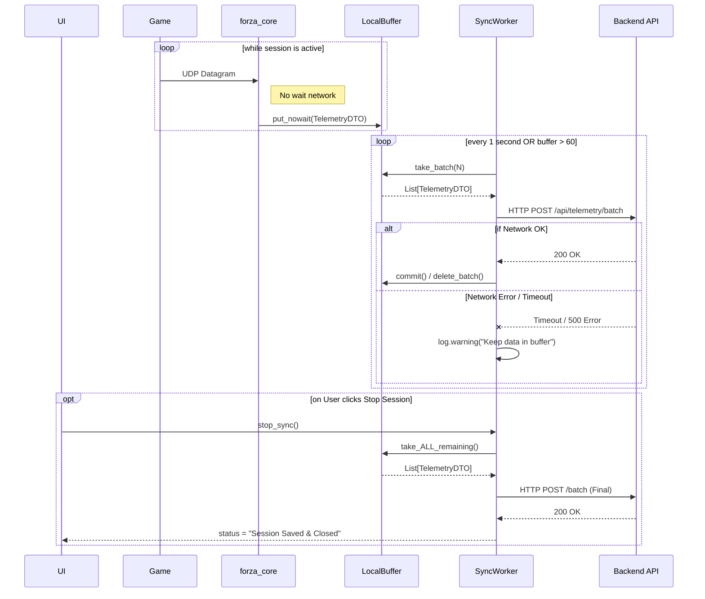

```mermaid
sequenceDiagram
    participant UI as UI
    participant Game as Game
    participant Core as forza_core
    participant Buf as LocalBuffer
    participant Sync as SyncWorker
    participant API as Backend API

    loop while session is active
        Game->>Core: UDP Datagram
        Note right of Core: No wait network
        Core->>Buf: put_nowait(TelemetryDTO)
    end

    loop every 1 second OR buffer > 60
        Sync->>Buf: take_batch(N)
        Buf-->>Sync: List[TelemetryDTO]
        Sync->>API: HTTP POST /api/telemetry/batch
        
        alt if Network OK
            API-->>Sync: 200 OK
            Sync->>Buf: commit() / delete_batch()
        else Network Error / Timeout
            API--xSync: Timeout / 500 Error
            Sync->>Sync: log.warning("Keep data in buffer")
        end
    end

    opt on User clicks Stop Session
        UI->>Sync: stop_sync()
        Sync->>Buf: take_ALL_remaining()
        Buf-->>Sync: List[TelemetryDTO]
        Sync->>API: HTTP POST /batch (Final)
        API-->>Sync: 200 OK
        Sync-->>UI: status = "Session Saved & Closed"
    end
```
