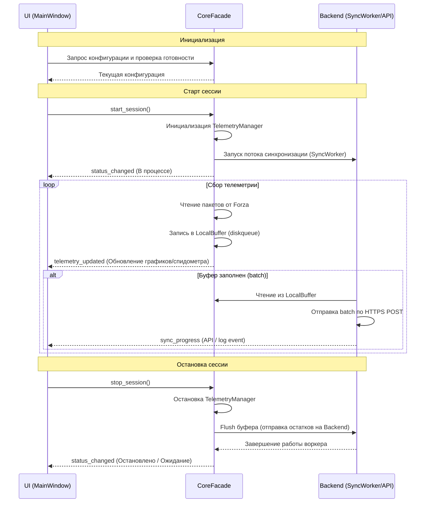
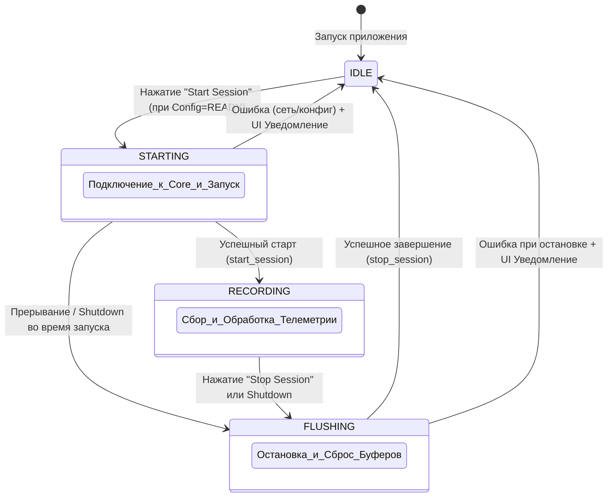
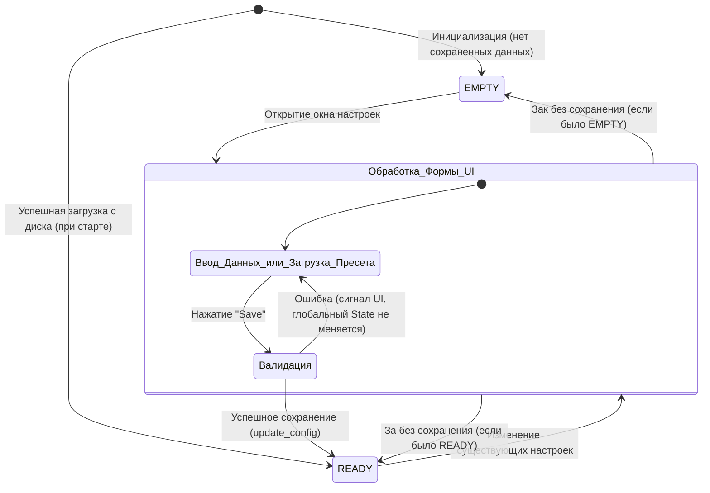

# 02. UI State and Flow

## Суть
В этом документе описывается, как информация и процессы "текут" через UI-слой приложения ForzaAITuner. Здесь представлены блок-схемы жизненного цикла работы приложения (Global Process Sequence), а также конечные автоматы (стейт-машины), описывающие конкретные состояния системы во время работы (Session State) и настройки (Config State). Также описаны механизмы реакции UI на события от подсистем Core и Backend.

---

## 1. Global Process Sequence

Диаграмма последовательности глобального процесса отражает взаимодействие UI с другими слоями (Core, Backend) от момента запуска приложения до его корректного закрытия.

---

## 2. Стейт-машины (State Diagram)

### 2.1 Session State (Состояние сеанса записи)

Жизненный цикл сессии записи телеметрии с точки зрения UI. Отражает то, какие элементы могут быть активны в разные моменты времени.

### 2.2 Config State (Состояние конфигурации)

Управление настройками осуществляется в выделенном диалоговом окне (ConfigDialog / SettingsDialog) с промежуточным этапом валидации перед сохранением на диск.

---

## 3. Реакция UI на события от Core и Backend

Для поддержания реактивности в приложении используется сигнал-слотовая модель (Qt Signals/Slots в связке с RX-паттернами через `WidgetBinding` / ViewModel). UI выступает пассивным слушателем и только отображает данные или диспатчит команды пользователя.

*   **Изменение статуса соединения с Forza (Core):**
    *   Событие: `status_changed(new_status)`
    *   Реакция UI: Изменение цвета индикатора соединения (например, с красного на зеленый). Разблокировка/блокирвока кнопки "Stop Session" / "Start Session".
*   **Прибытие новых пакетов телеметрии (Core):**
    *   Событие: `telemetry_updated(telemetry_data)`
    *   Реакция UI: Обновление текстовых полей (Скорость, Обороты) и графиков в реальном времени (со строгим троттлингом (throttling), чтобы не перегружать главный поток отрисовки Qt).
*   **Синхронизация с сервером (Backend/SyncWorker):**
    *   Событие: `sync_progress(bytes_sent, total_batches)`
    *   Реакция UI: Обновление `QProgressBar` или значка синхронизации в статус-баре.
*   **Ошибки бекенда:**
    *   Событие: `backend_error(error_code, message)`
    *   Реакция UI: Всплывающее предупреждение (Notification/Tooltip), запись в лог в статус-баре, без прерывания самой сессии локальной сборки (согласно архитектурному правилу "локальный буфер спасает данные").
*   **Изменение конфигурации вне UI (Remote push / Config reload):**
    *   Событие: `config_reloaded(new_config)`
    *   Реакция UI: Моментальное применение новых лимитов и адресов (изменение текста в лейблах, обновление полей настроек).
