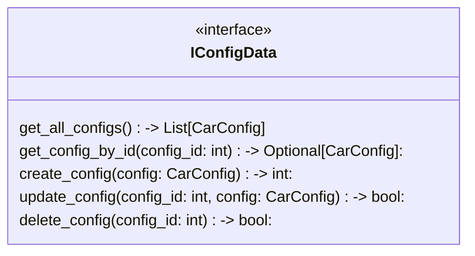

## Функции

### Get
* **get_all_configs** -> List [CarConfig] - Возвращает список всех сохраненных конфигураций для окна Библиотеки.
* **get_config_by_id** -> Optional [CarConfig] - Получает полные данные одной конфигурации для окна Редактора.

### Create
* **create_config** -> int - Сохраняет новую конфигурацию в БД. Возвращает её новый ID.

### Update
* **update_config** -> bool - Обновляет существующую конфигурацию после редактирования.

### Delete
* **delete_config** -> bool - Удаляет конфигурацию из БД.