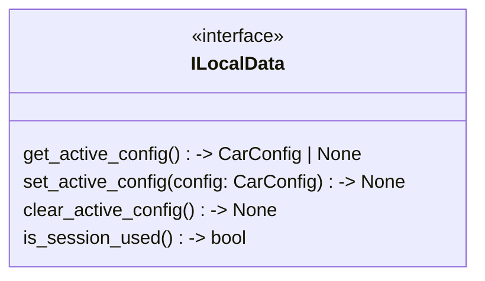

## Функции

### Config
* **get_active_config** -> CarConfig | None - Загружает последнюю активную настройку при старте программы.
* **set_active_config** -> None - Делает переданную настройку активной (нажатие кнопки Change).
* **clear_active_config** -> None - Сбрасывает активную настройку (например, если ее удалили из Библиотеки).

### Session
* **is_session_used** -> bool - Читает поле 'Used' из JSON, чтобы понять, идет ли заезд.