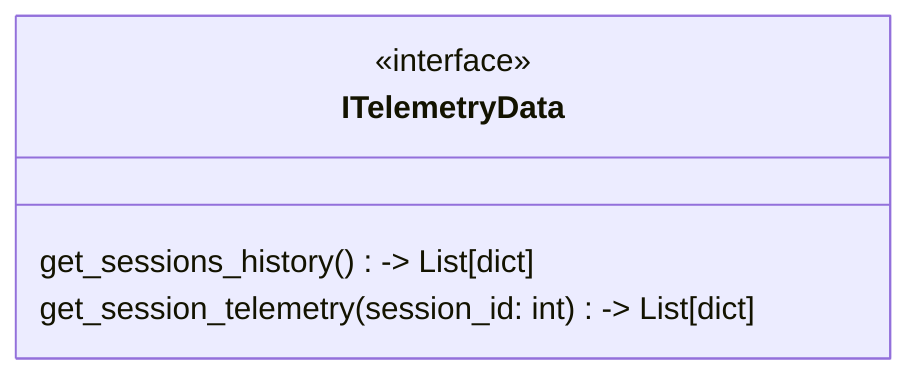

## Функции

### Get
* **get_sessions_history** -> List[dict] - Возвращает список всех прошедших заездов пользователя.
* **get_session_telemetry** -> List[dict] - Выгружает массивы данных (скорость, обороты, подвеска) для графиков по конкретному заезду.