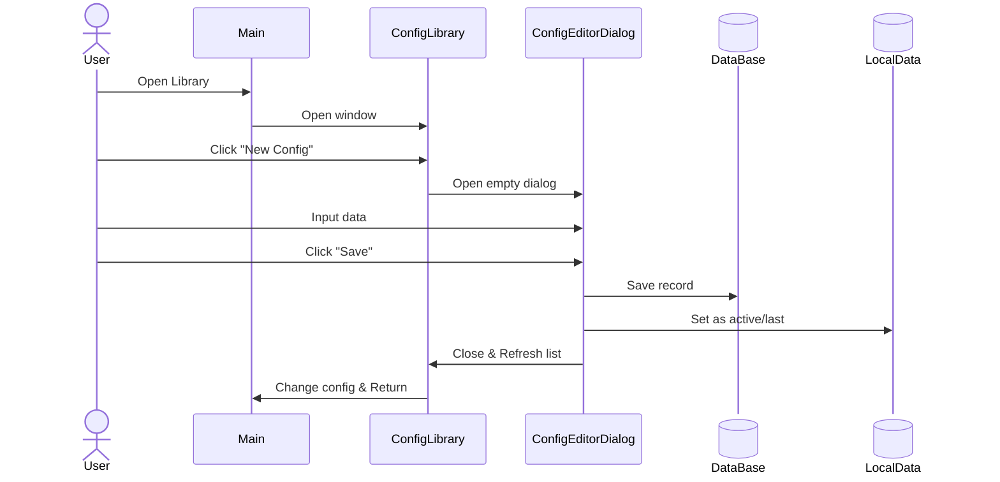
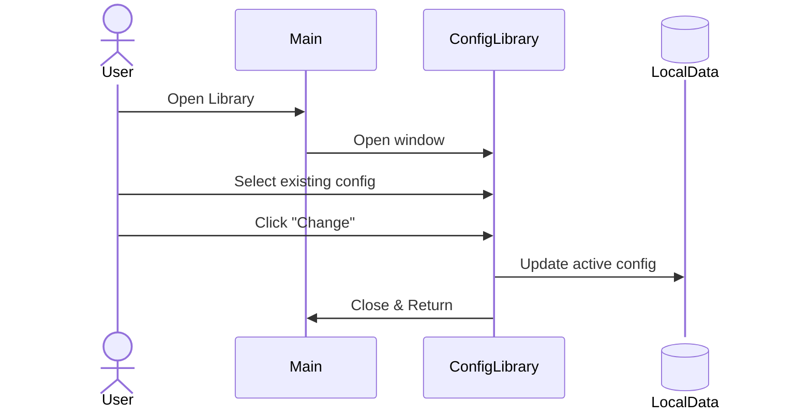
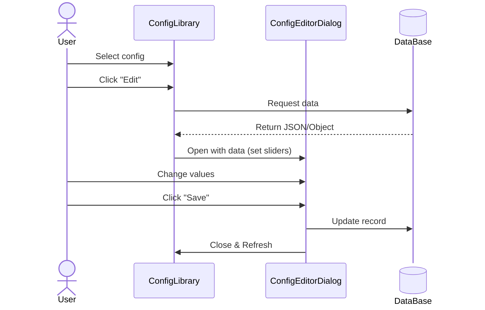
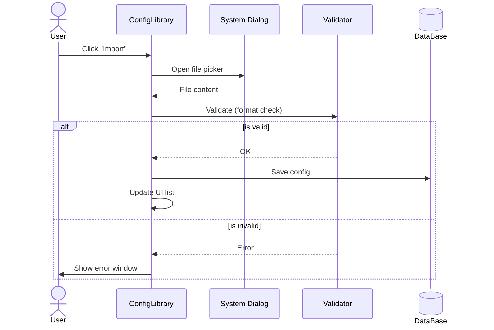
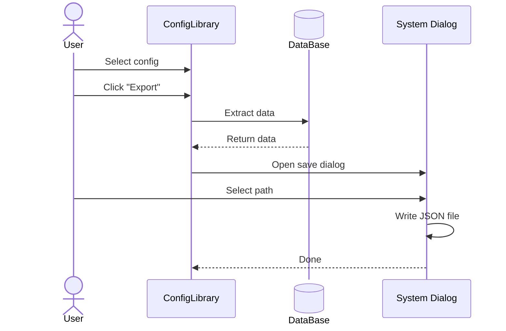
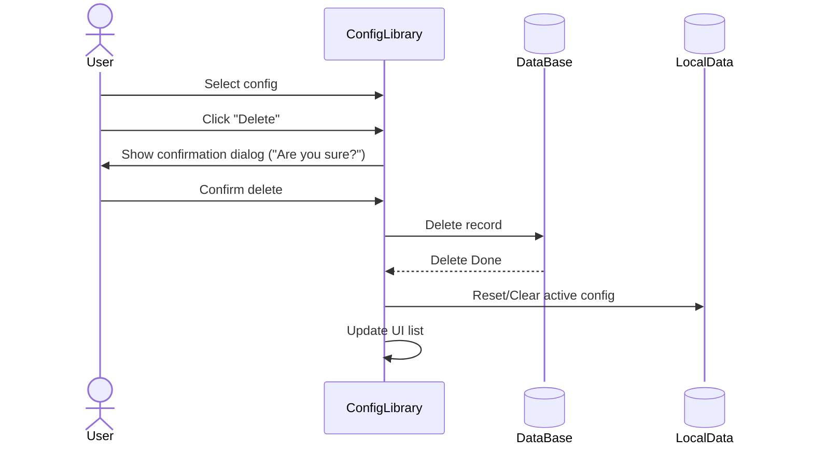
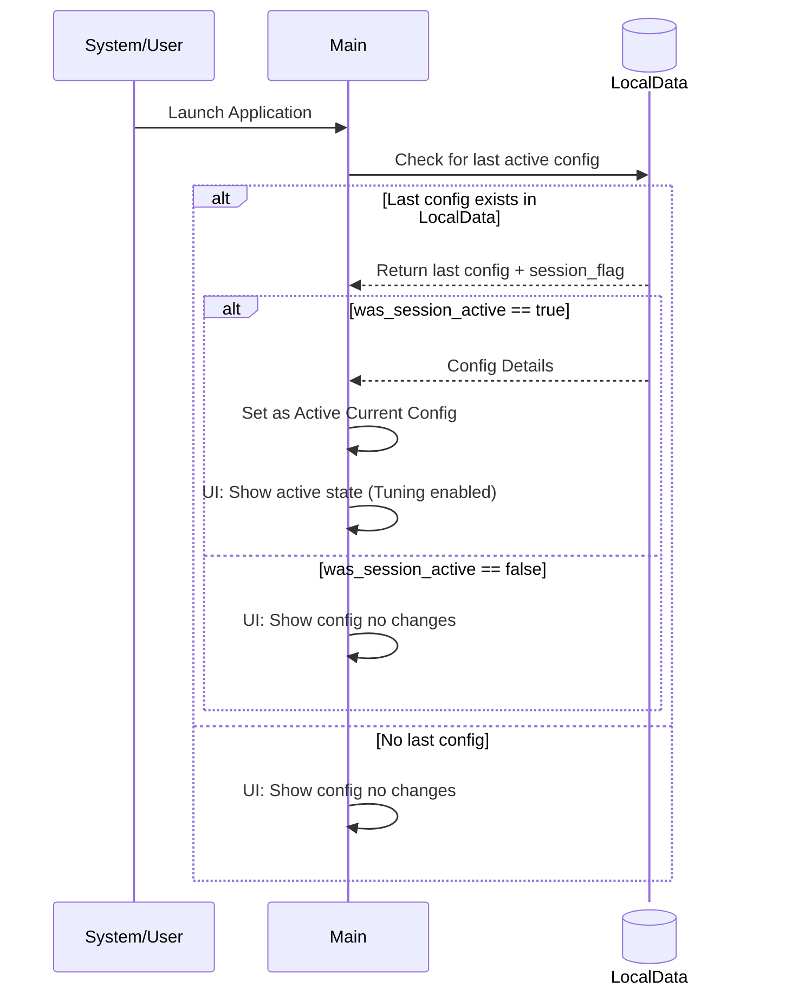

### 1. New Config Create (Создание новой конфигурации)

### 2. Change Config (Изменение/Выбор активного конфига)

### 3. Edit Config (Редактирование существующей конфигурации)

### 4. Import Config (Импорт конфигурации)

### 5. Export Config (Экспорт конфигурации)

### 6. Удаление конфигурации (Delete Config)

### 7. Инициализация при запуске (Startup / Load Last Config)

