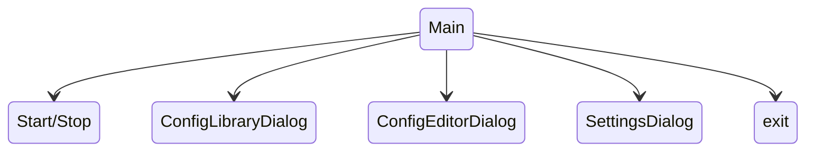
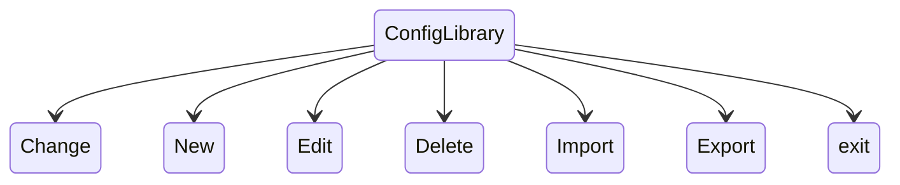
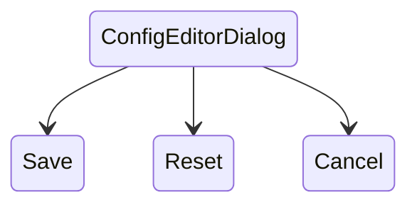

# Взаимодействия в окнах (Window Interactions)

В этом документе описаны действия, доступные пользователю через кнопки в различных окнах приложения. Эти диаграммы показывают возможные пути взаимодействия пользователя с интерфейсом (куда можно нажать).

## Главное окно (Main Window)

### Описание :
*   **Start/Stop:** Запуск и остановка сессии заезда
*   **ConfigLibraryDialog:** Открытие библиотеки конфигураций тюнинга. -> переход в окно библиотеки конфигураций.
*   **ConfigEditorDialog:** Быстрый переход к редактированию текущей конфигурации если выбрана. -> переход к редактированию текущей конфигурации.
*   **SettingsDialog:** Переход в меню общих настроек приложения. -> открытие окна настроек.
*   **Exit:** Завершение работы программы.

---

##  Библиотека конфигураций (ConfigLibrary)

### Описание:
*   **Change:** Выбор существующей конфигурации для использования -> переход в основное окно.
*   **New:** Создание новой пустой конфигурации -> переход в редактор конфигурации.
*   **Edit:** Редактирование параметров выбранной конфигурации -> переход в редактор конфигурации.
*   **Delete:** Безвозвратное удаление конфигурации.
*   **Import:** Импорт конфигурации из внешнего файла.
*   **Export:** Экспорт конфигурации в внешний файл.
*   **Exit:** Завершение работы программы.

---

## Редактор конфигурации (ConfigEditorDialog)

**Описание кнопок:**
*   **Save:** Фиксация внесенных изменений в базе данных. -> переход в окно из которого был вызван редактор конфигурации.
*   **Reset:** Сброс всех несохраненных изменений к исходным значениям.
*   **Cancel:** Закрытие редактора без сохранения изменений. -> переход в окно из которого был вызван редактор конфигурации.
