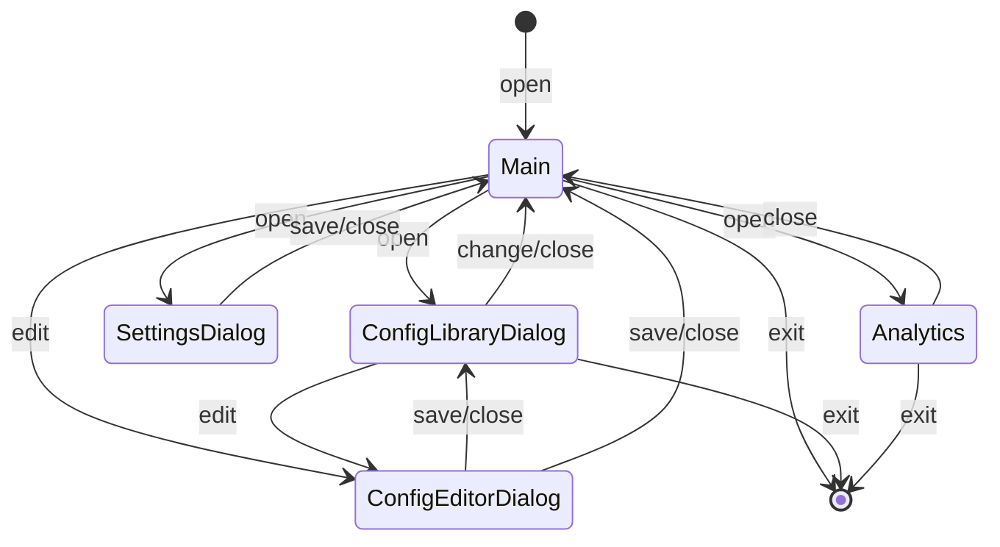

# Переходы между окнами (Navigation Flow)

Данная диаграмма описывает логику переходов между основными окнами и диалогами приложения. Она определяет, как пользователь перемещается по интерфейсу.

### Описание переходов:

**Main (Главное окно):** Центральная точка входа. Из него можно открыть библиотеку конфигураций, или редактор текущей конфигурации нажав на значёк рядом с именем конфигурации, настройки, окно анализа результатов.

**ConfigLibraryDialog (Библиотека):** Позволяет просматривать список конфигураций. Можно либо выбрать конфигурацию и вернуться в Main, либо перейти к редактированию или создать новую конфигурацию.

**ConfigEditorDialog (Редактор):** Окно для детальной настройки изменения значений параметров. После сохранения или отмены пользователь возвращается либо в библиотеку, либо сразу в главное окно (если переход был из него).

**SettingsDialog (Настройки):** Настройки приложения. Открывается поверх основного окна. Возврат всегда в главное окно.

**Analytics (Аналитика):** Окно просмотра телеметрии. Открывается вместо основного окна - является робочей зоной. Возврат в основное окно.
