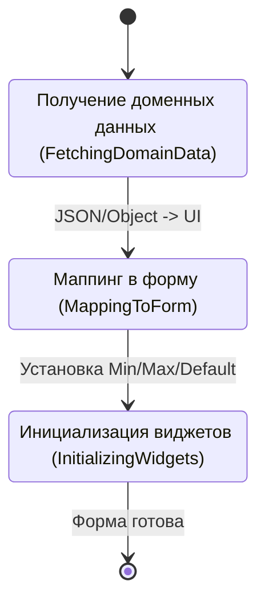
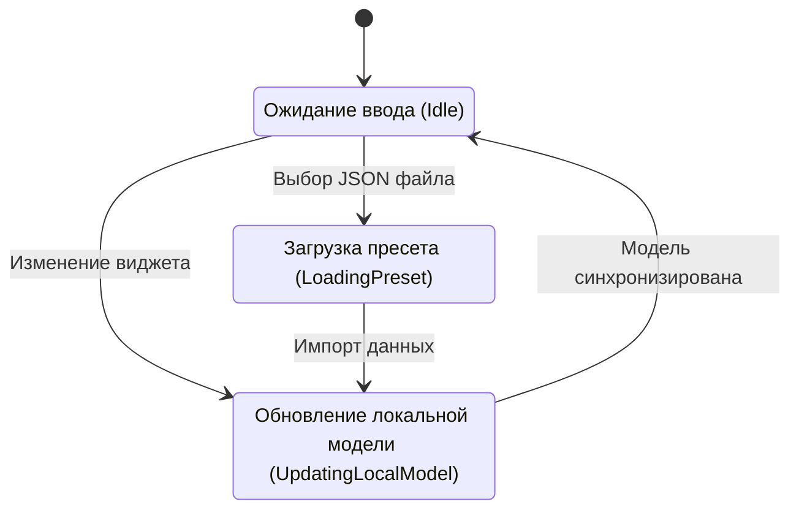
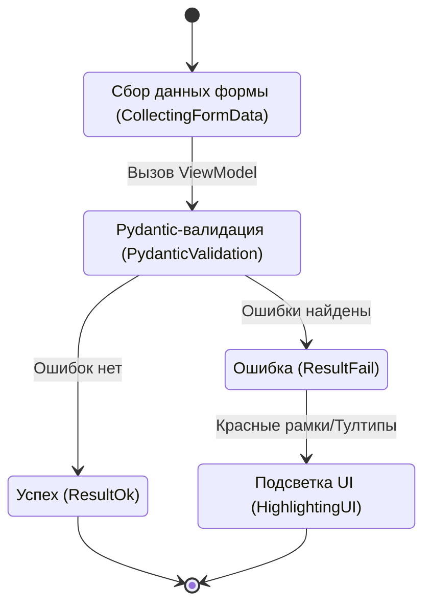
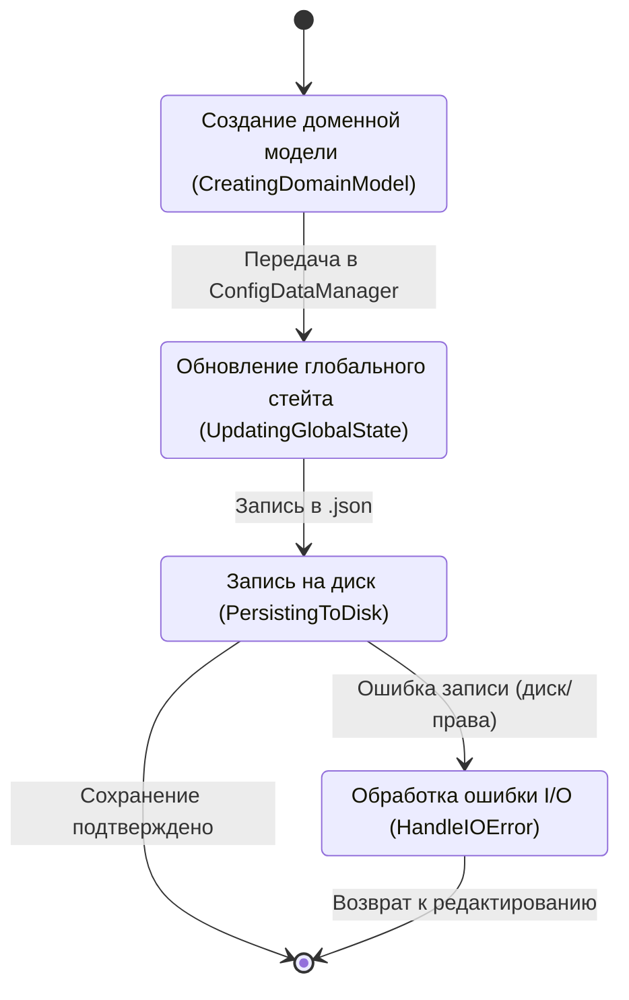
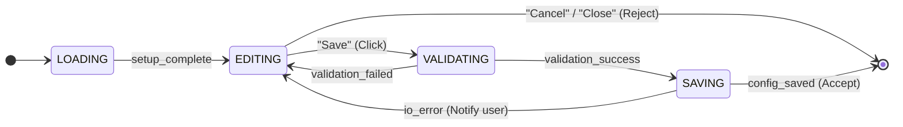

# Состояния окна ConfigDialog

Данный файл описывает состояния и логику работы диалогового окна конфигурации.

## 1. Детальные диаграммы состояний

### Загрузка (LOADING)
Подготовка данных для формы.

### Редактирование (EDITING)
Интерактивное взаимодействие.

### Проверка (VALIDATING)
Валидация бизнес-правил и типов.

### Сохранение (SAVING)
Фиксация изменений.

## 2. Диаграмма связей и переходов

Высокоуровневая логика управления диалогом.

## Описание состояний

| Состояние | Описание |
| :--- | :--- |
| **LOADING** | Загрузка текущих настроек из доменного слоя и инициализация виджетов маппером. |
| **EDITING** | Основное состояние взаимодействия. Пользователь меняет параметры или загружает пресеты из JSON. |
| **VALIDATING** | Проверка введенных данных через Pydantic-модели во ViewModel. |
| **SAVING** | Применение изменений к глобальному стейту приложения и сохранение на диск. |

---
**Связанный код:**
- [config_dialog.py](./src/desktop_client/presentation/views/config_dialog.py)
- [tuning_binder.py](./src/desktop_client/presentation/mappers/tuning_binder.py)
