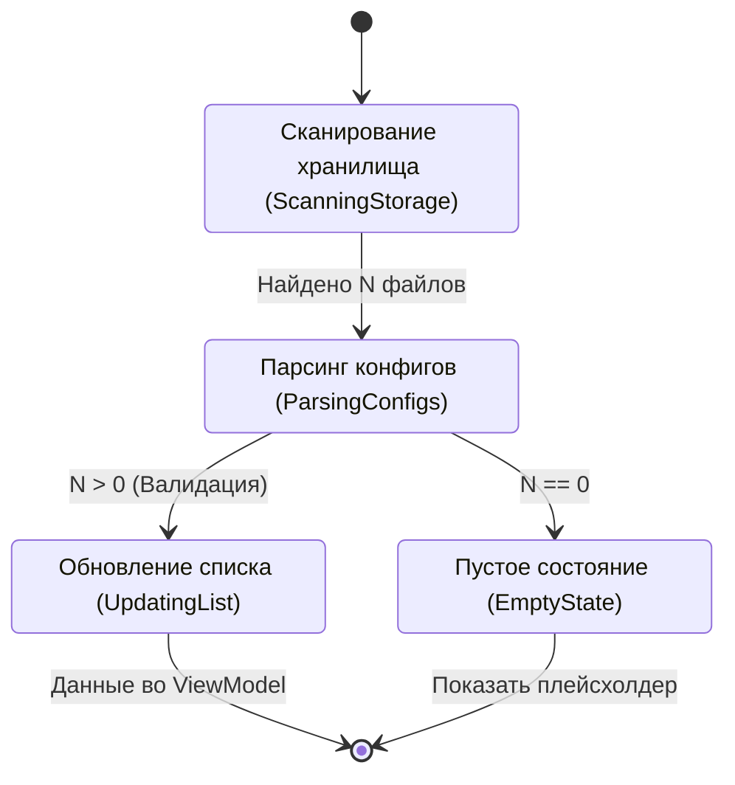
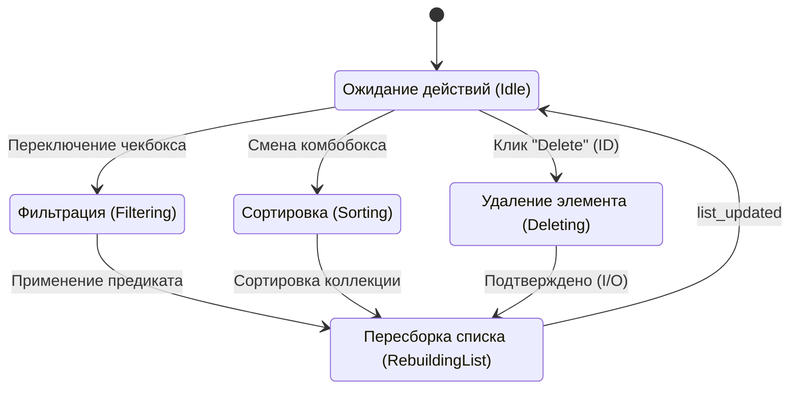
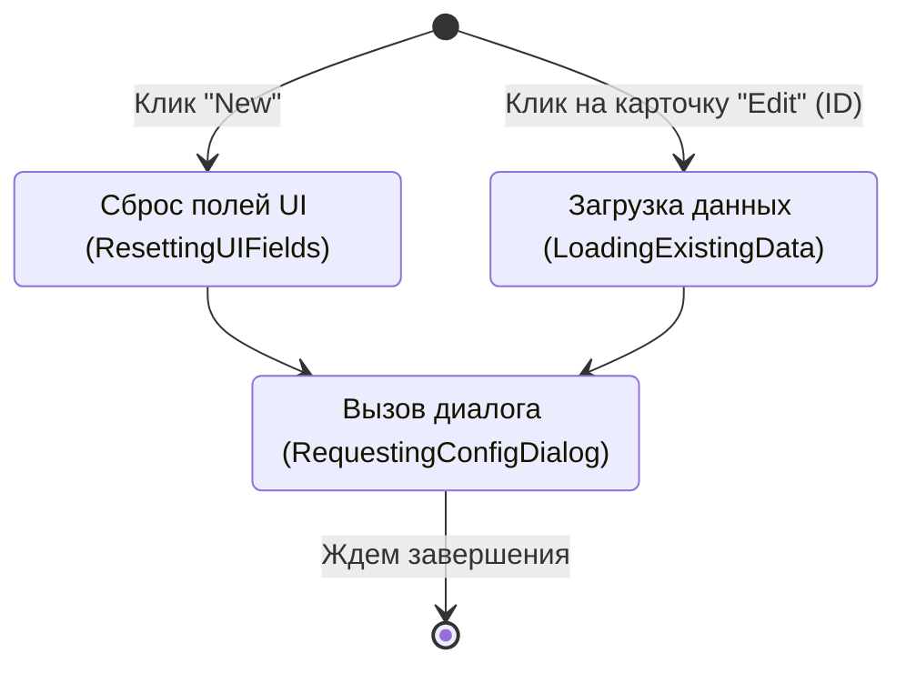
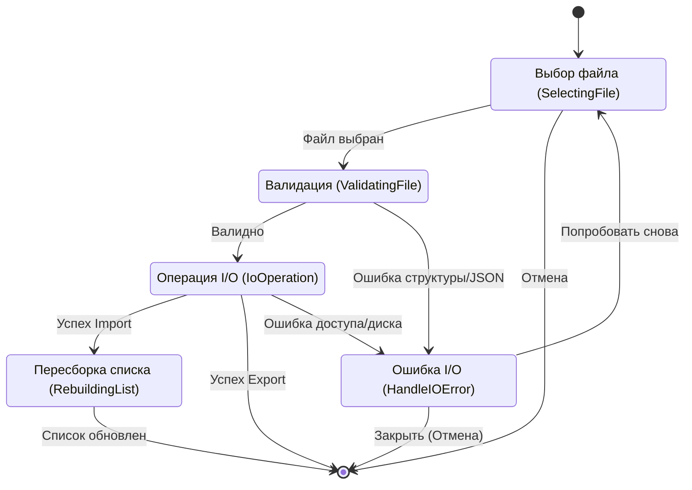
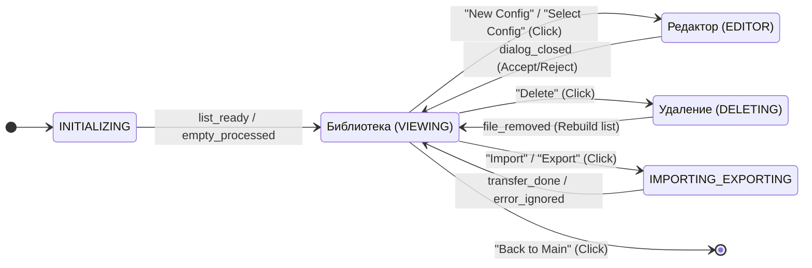

# Состояния окна LibraryConfig

Данный файл описывает логику работы окна библиотеки конфигураций.

## 1. Детальные диаграммы состояний

### Инициализация (INITIALIZING)
Загрузка данных из БД/Файлов.

### Просмотр (VIEWING)
Активный режим пользователя.

### Вызов редактора (EDITOR_INVOCATION)
Подготовка диалога для нового или существующего конфига.

### Импорт/Экспорт (IMPORTING_EXPORTING)
Обработка внешних файлов конфигураций с валидацией и обработкой ошибок.

## 2. Диаграмма связей и переходов

Высокоуровневая логика библиотеки.

## Описание состояний

| Состояние | Описание |
| :--- | :--- |
| **INITIALIZING** | Первичная загрузка списка. Теперь включает обработку **EmptyState** для первого запуска. |
| **VIEWING** | Основной экран. Позволяет не только фильтровать, но и инициировать удаление или редактирование. |
| **EDITOR_INVOCATION** | Промежуточный стейт для подготовки данных (сброс для новых, загрузка для старых) перед открытием диалога. |
| **DELETING** | Фаза физического удаления файла с последующим автоматическим обновлением списка. |
| **IMPORTING_EXPORTING** | Работа с системным диалогом файлов. Блокирует основной UI. Включает валидацию JSON и обновление списка после импорта. |

---
**Связанный код:**
- [config_library_viewmodel.py](./src/desktop_client/presentation/viewmodels/config_library_viewmodel.py)
- [ui_config_library.py](./src/desktop_client/presentation/ui/generated/ui_config_library.py)
