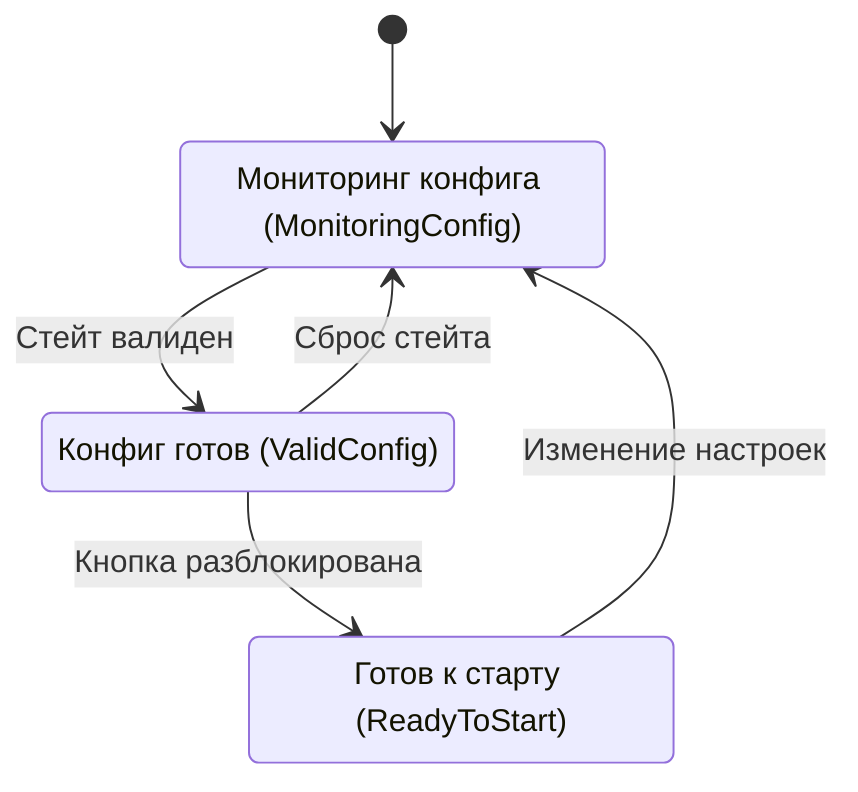
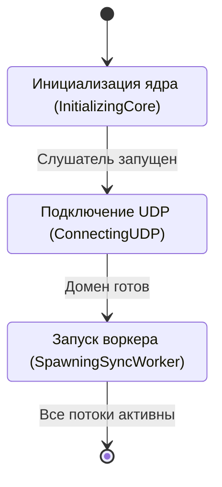
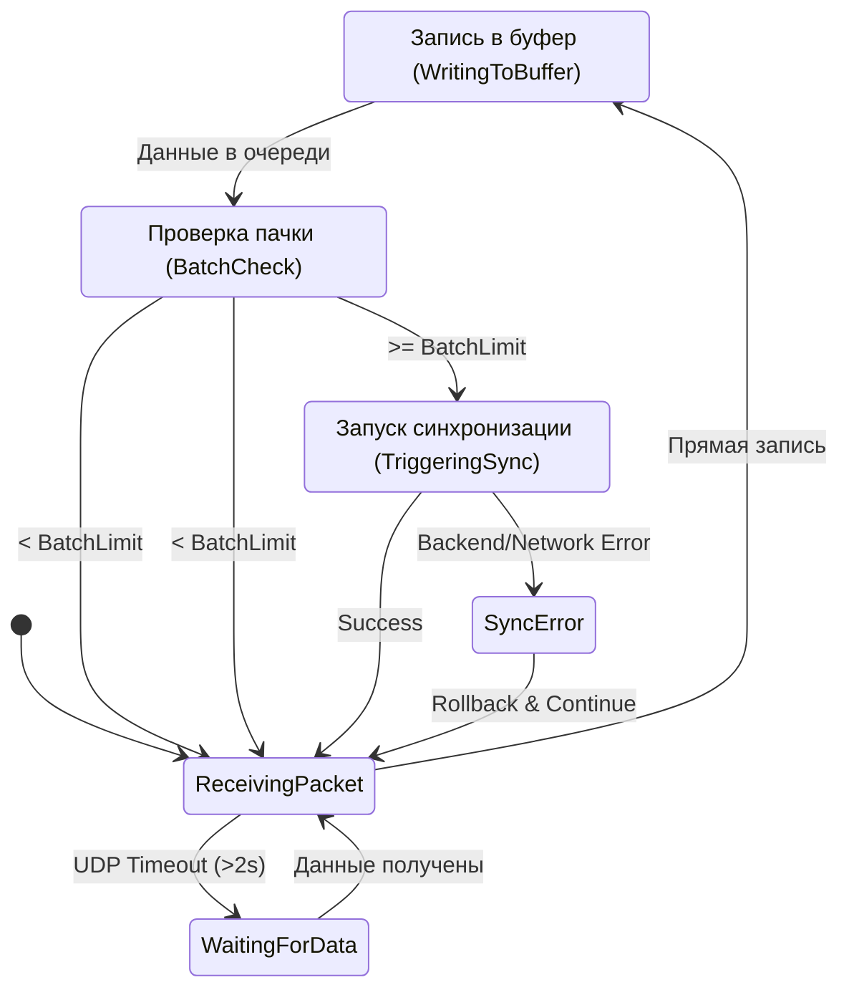
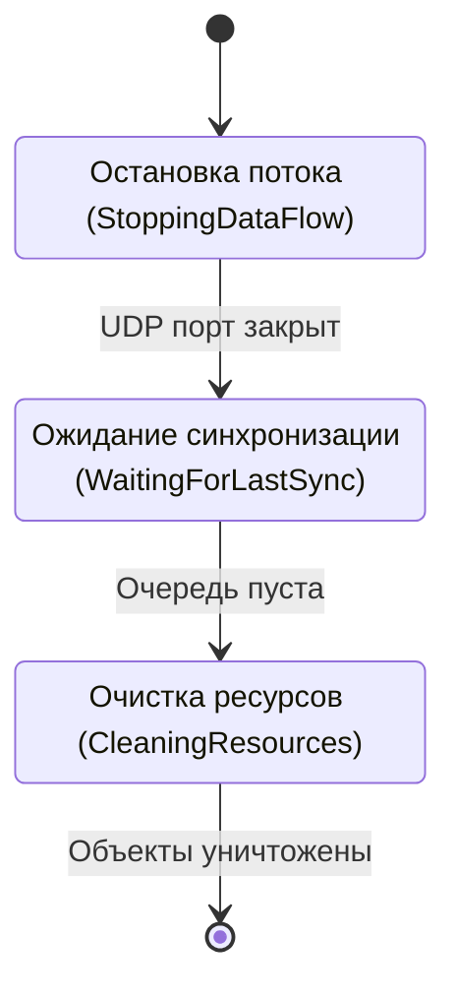
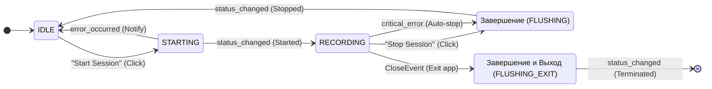

# Состояния окна Main

Данный файл описывает внутренние состояния главного окна приложения. Маршрутизация между окнами описана в [state_Overview.md](./state_Overview.md).

## 1. Детальные диаграммы состояний

### Ожидание (IDLE)
В этом состоянии приложение не собирает данные, но следит за готовностью конфигурации.

### Запуск (STARTING)
Процесс подготовки ресурсов.

### Запись (RECORDING)
Цикл обработки данных в реальном времени.

### Завершение (FLUSHING)
Гарантированная доставка данных перед выходом.

## 2. Диаграмма связей и переходов

Эта диаграмма описывает только высокоуровневые триггеры между состояниями.

## Описание состояний

| Состояние | Описание |
| :--- | :--- |
| **IDLE** | Окно ожидает действий пользователя. Кнопка Start активна только при наличии валидной конфигурации. |
| **STARTING** | Переходное состояние. Инициализация Core-компонентов и запуск потоков синхронизации. |
| **RECORDING** | Активная фаза сбора данных. UI находится в режиме ожидания, отображая только базовые индикаторы активности. |
| **FLUSHING** | Процесс остановки. Приложение дожидается отправки оставшихся данных из буфера перед возвратом в IDLE. |

## Переходы и события

- **Start Session**: Инициирует переход `IDLE -> STARTING`.
- **Stop Session**: Инициирует переход `RECORDING -> FLUSHING`.
- **Error**: Любая критическая ошибка во время `STARTING` возвращает систему в `IDLE`.
- **Shutdown**: Инициирует `FLUSHING` из любого активного состояния.

> [!WARNING]
> **ТЕХНИЧЕСКИЙ ДОЛГ:** ТЕКУЩИЙ LocalBuffer ХРАНИТ ДАННЫЕ В ПАМЯТИ. НЕОБХОДИМ РЕФАКТОРИНГ ПОД ХРАНЕНИЕ НА ДИСКЕ (DISK-QUEUE) ДЛЯ ПОЛНОЦЕННОЙ РЕАЛИЗАЦИИ СХЕМЫ "ЛОКАЛЬНЫЙ БУФЕР СПАСАЕТ ДАННЫЕ".

---
**Связанный код:**
- [main_window.py](./src/desktop_client/presentation/views/main_window.py)
- [app_state.py](./src/desktop_client/presentation/state/app_state.py)
