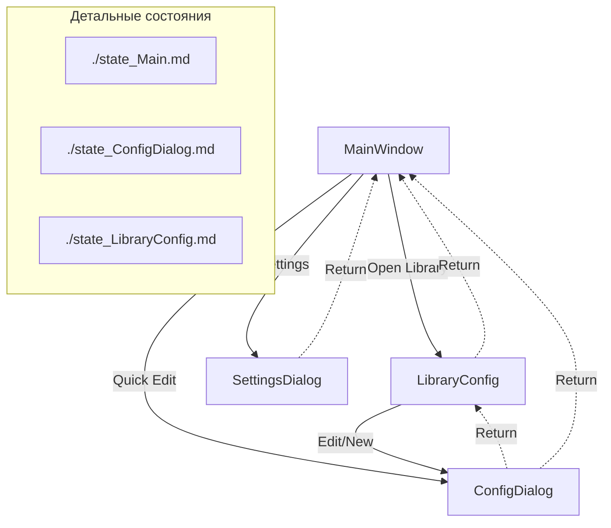

# Обзор состояний и навигации

Этот файл связывает отдельные окна приложения и описывает высокоуровневую маршрутизацию между ними.

## Общая карта окон и переходов

## Ссылки на детальные описания

1.  **[MainWindow (Главное окно)](./state_Main.md)**
    *   Управление сессией телеметрии.
    *   Жизненный цикл записи: IDLE -> STARTING -> RECORDING -> FLUSHING.
2.  **[LibraryConfig (Библиотека)](./state_LibraryConfig.md)**
    *   Управление списком конфигураций.
    *   Фильтрация и сортировка заездов.
3.  **[ConfigDialog (Редактор)](./state_ConfigDialog.md)**
    *   Редактирование конкретной настройки.
    *   Вызывается из **LibraryConfig** (для новых/выбранных) или напрямую из **MainWindow** (Быстрый Edit текущего конфига).
    *   Цикл валидации и сохранения.

## Правила взаимодействия

- **Состояния изолированы**: Каждое окно владеет своим внутренним стейтом. Переходы между окнами инициируются через `DialogService` или сигналы ViewModel.
- **Глобальный стейт**: Изменения в `ConfigDialog` влияют на `ConfigState`, который является общим для `Main` и `Library`. Реактивное обновление гарантирует, что `Main` подхватит новую конфигурацию сразу после сохранения.
- **Навигация**: Осуществляется через абстракцию `IDialogService`, что позволяет менять логику отображения (например, модально или в стеке) без изменения логики окон.
- **Управление стеком (Lifecycle)**: Во избежание переполнения стека и утечек памяти, переходы типа `CD -> Lib` или `SD -> Main` являются операциями **возврата (POP)**. 
    - **Контекст вызова**: Так как `ConfigDialog` (CD) может быть вызван из двух разных мест (`Main` или `Lib`), `DialogService` или контроллер окна должен сохранять информацию о вызывающем окне (через стек навигации или parent-ссылку), чтобы корректно выполнить возврат.
    - Окно конфигурации или настроек должно быть уничтожено при закрытии, а не порождать новый экземпляр родительского окна поверх себя.

---
**Расположение в проекте:**
- Представления: [./src/desktop_client/presentation/views/](./src/desktop_client/presentation/views/)
- Модели состояний: [./src/desktop_client/presentation/state/](./src/desktop_client/presentation/state/)
