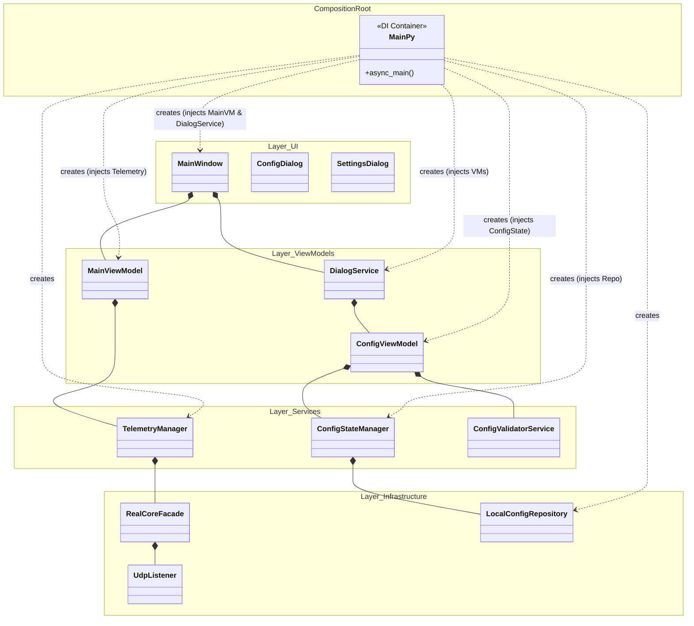

## DI Architecture

```mermaid
classDiagram
    direction TB

    namespace CompositionRoot {
        class MainPy {
            <<DI Container>>
            +async_main()
        }
    }

    namespace Layer_UI {
        class MainWindow
        class ConfigDialog
        class SettingsDialog
    }

    namespace Layer_ViewModels {
        class MainViewModel
        class ConfigViewModel
        class DialogService
    }

    namespace Layer_Services {
        class TelemetryManager
        class ConfigStateManager
        class ConfigValidatorService
    }

    namespace Layer_Infrastructure {
        class RealCoreFacade
        class LocalConfigRepository
        class UdpListener
    }

    MainPy ..> TelemetryManager : creates
    MainPy ..> LocalConfigRepository : creates
    MainPy ..> ConfigStateManager : creates (injects Repo)
    MainPy ..> MainViewModel : creates (injects Telemetry)
    MainPy ..> ConfigViewModel : creates (injects ConfigState)
    MainPy ..> DialogService : creates (injects VMs)
    MainPy ..> MainWindow : creates (injects MainVM & DialogService)

    MainWindow *-- MainViewModel
    MainWindow *-- DialogService
    DialogService *-- ConfigViewModel
    MainViewModel *-- TelemetryManager
    TelemetryManager *-- RealCoreFacade
    RealCoreFacade *-- UdpListener
    ConfigViewModel *-- ConfigStateManager
    ConfigViewModel *-- ConfigValidatorService
    ConfigStateManager *-- LocalConfigRepository
```