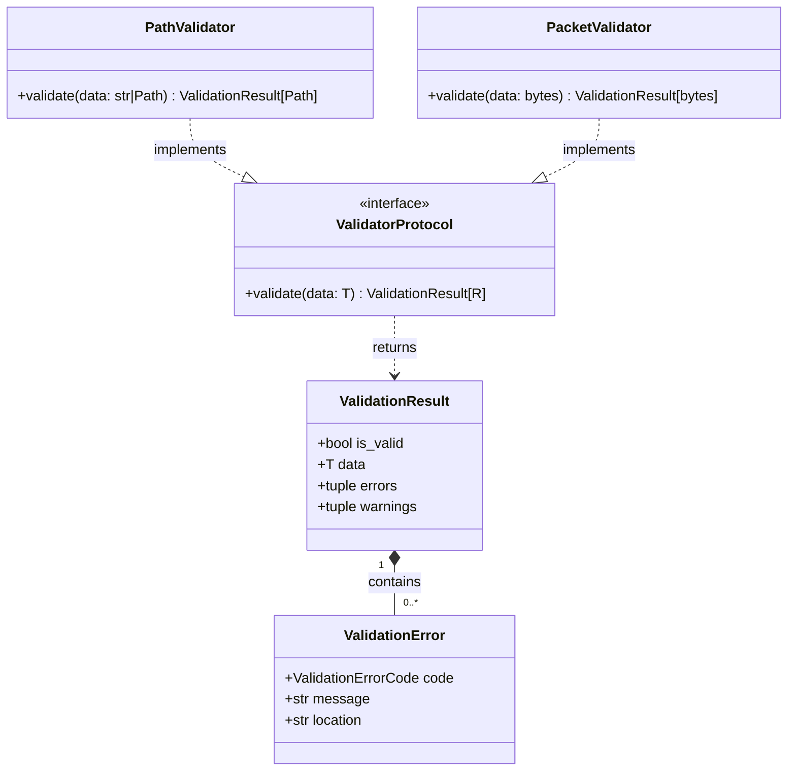

# Validation Module Guide

The **validation** module is responsible for checking incoming data (network packets, paths, files) before it is processed by the application's business logic. The module is built on SOLID principles, strict typing, and immutability of results.

## 1. Core Architecture

The module architecture centers around two key components:

1.  **ValidatorProtocol[T, R]** (in `protocols.py`): A single contract for all validators. Any validator must implement the `validate(self, data: T) -> ValidationResult[R]` method.
2.  **ValidationResult[T]** (in `models.py`): An immutable (`frozen=True`) dataclass representing the verification result. It ensures no hidden states or side effects. Errors are stored as tuples.

### Class Diagram



## 2. Using Existing Validators

Validators are typically initialized once (often during dependency injection) and can be reused.

```python
from desktop_client.validation import PathValidator, PacketValidator

# 1. Initialization (with configuration injection)
path_validator = PathValidator(base_dir="/safe/directory")
packet_validator = PacketValidator(allowed_sizes={311, 324})

# 2. Calling the validate() method
result = path_validator.validate("/safe/directory/config.json")

# 3. Handling the result
if not result.is_valid:
    for error in result.errors:
        print(f"Error [{error.code}]: {error.message}")
else:
    safe_path = result.data # Guaranteed safe and converted type (Path)
    # logic using safe_path...
```

## 3. Extending the Module (Creating New Validators)

To add a new validator, follow these 3 steps:

### Step 1: Add an error code (if needed)
Open `models.py` and add a new value to `ValidationErrorCode`:

```python
class ValidationErrorCode(str, Enum):
    # ... existing codes ...
    INVALID_CONFIG_FORMAT = "invalid_config_format" # Your new code
```

### Step 2: Create the validator class
Create a new file or add a class to an existing one (e.g., `business_rules.py`), implementing `ValidatorProtocol`. Do not use `raise` for business errors; always return `ValidationResult`.

```python
from typing import Any
from .models import ValidationResult, ValidationError, ValidationErrorCode

class ConfigFormatValidator:
    """Checks the basic configuration structure."""
    
    def validate(self, data: dict[str, Any]) -> ValidationResult[dict[str, Any]]:
        if "version" not in data:
            return ValidationResult(
                is_valid=False,
                errors=(ValidationError(
                    code=ValidationErrorCode.INVALID_CONFIG_FORMAT,
                    message="Missing required field 'version'",
                    location="root.version"
                ),)
            )
            
        return ValidationResult(is_valid=True, data=data)
```

### Step 3: Export the validator
Add your new validator to `__init__.py` to encapsulate the module's internal structure:

```python
from .business_rules import ConfigFormatValidator

__all__ = [
    # ...
    "ConfigFormatValidator",
]
```

## 4. Modifying Existing Validators

The module is designed to minimize changes to existing code (Open/Closed Principle).

*   **Changing Parameters**: If you need to change file size limits or allowed packet sizes, don't change the class source code. Instead, pass new values through the constructor.

```python
# WRONG: changing DEFAULT_ALLOWED_SIZES in the class itself
# CORRECT:
validator = PacketValidator(allowed_sizes={100, 200, 300})
```

*   **Modifying Validation Logic**: If business requirements fundamentally change (e.g., `TelemetrySanityValidator` should check nested structures), add this logic to the `validate` method while maintaining contract compatibility. Use guard clauses to protect against dynamic operations.

## 5. Architectural Rules (Best Practices)

1.  **No Exceptions for Business Logic**: Exceptions (`try...except`) inside validators should only be used to catch system errors (e.g., `OSError` during file reading). The result should always be wrapped in `ValidationResult(is_valid=False)`.
2.  **Typing**: Always specify types for arguments and the return value `ValidationResult[YourType]`. If a validator transforms data (e.g., takes `str` and returns `Path`), reflect this in annotations: `def validate(self, data: str) -> ValidationResult[Path]`.
3.  **Immutability**: Never attempt to modify a `ValidationResult` object after creation. The `errors` and `warnings` tuples are read-only.
