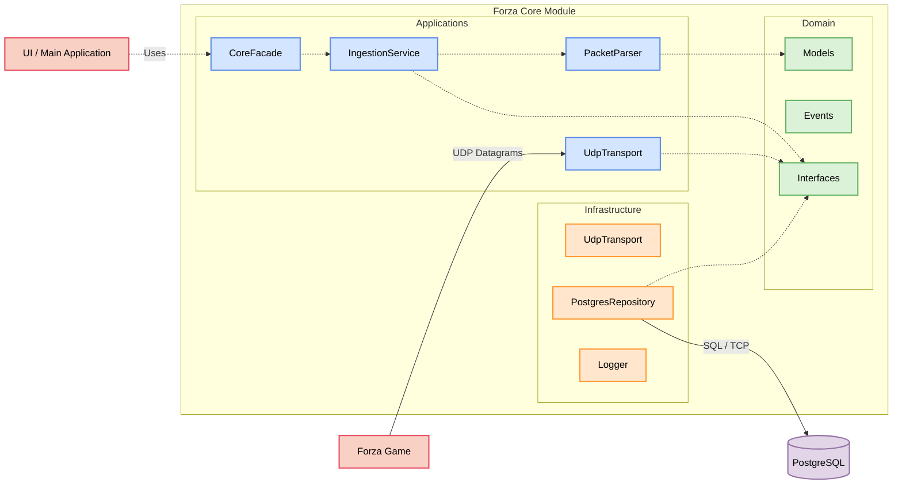

# Core Module Overview

## Суть
Верхнеуровневый взгляд на модуль `forza_core`. Модуль является исключительно "поставщиком" данных (Provider). Он не знает о базах данных, HTTP-запросах на бэкенд и пользовательском интерфейсе.

## Архитектура

## Component Brief

* **AppLayer**: Слой приложения, содержащий основные сервисы такие как `CoreFacade`, транспорт для получения данных (`UdpTransport`), пайплайн обработки (`IngestionService`) и логику парсинга сырых байтов (`PacketParser`).
* **DomainLayer**: Доменная логика, описывающая структуры данных и контракты. Включает строгие Pydantic модели (`Models`), интерфейсы (`Interfaces`) и события (`Events`).
* **InfraLayer**: Инфраструктурный слой (реализация интерфейсов). Содержит реализацию `UdpTransport`, работу с логгером (`Logger`) и репозиториями (`PostgresRepository`).
