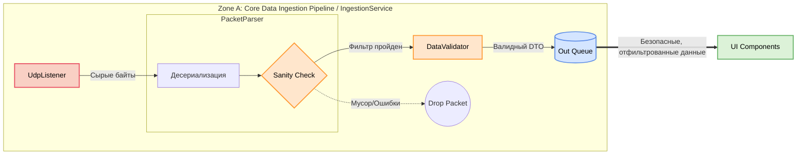
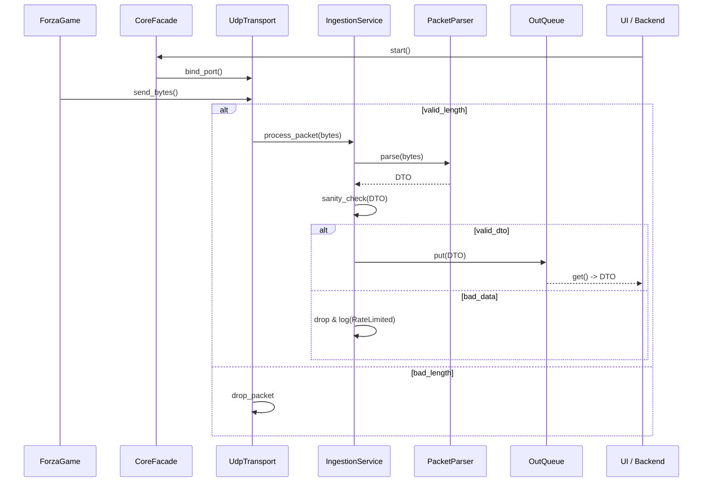

# Core Data Flow

## Суть
Как данные летят от игры до наружной очереди. Описание пути данных от момента их отправки игрой до попадания в наружную очередь для потребителей (от игры до UI/Backend).

## Core Data Ingestion Pipeline

*Примечание к схеме:*
* **UdpListener** выступает как недоверенный источник данных.
* **Sanity Check** включает внутри себя базовый фильтр размера пакета и валидацию на `NaN`.

## How it works (По шагам)
1. **Получение UDP**: Приложение слушает UDP-порт и получает сырые байты от игры.
2. **Валидация размера пакета**: На самом раннем этапе (немедленно после `recvfrom`) отсеиваются пакеты с некорректным размером. Это происходит **строго до** попадания в пайплайн обработки и аллокации памяти под объекты.
3. **Парсинг**: Сырые байты десериализуются в понятную структуру данных (DTO) с помощью `PacketParser`.
4. **Sanity Check**: Выполняется валидация распакованных данных (проверка на `NaN`, отрицательные или нереалистичные значения) с помощью `DataValidator`.
5. **Отправка в OutQueue**: Полностью валидный `TelemetryDTO` передается в наружную очередь (IOutQueue), откуда его забирают другие модули (UI).

## Укороченная Sequence Diagram передачи данных

