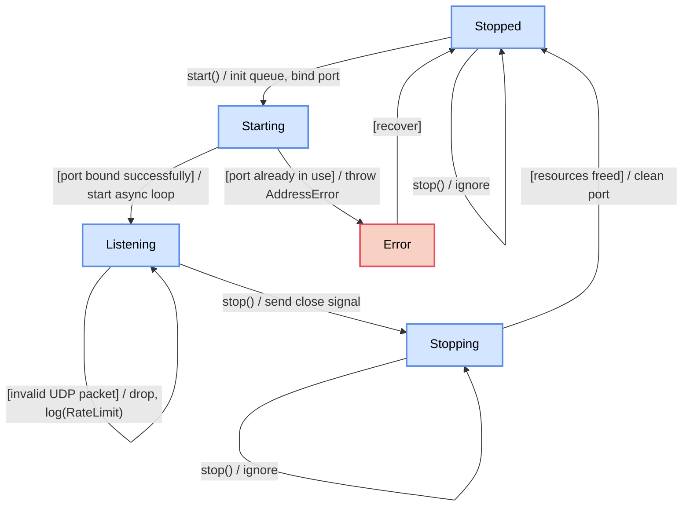
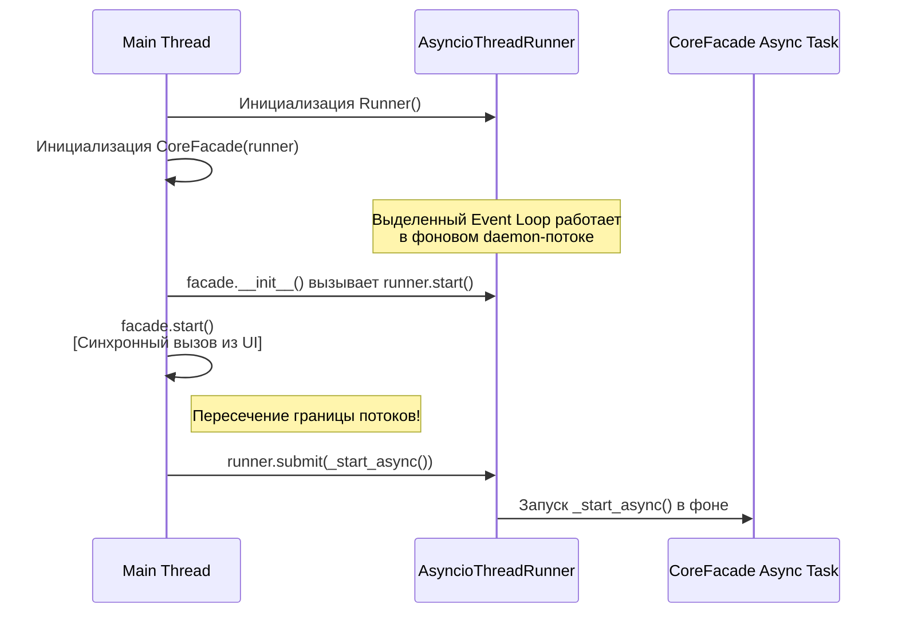

# CoreFacade Details

## Суть
Описание главного класса-фасада `CoreFacade` и его жизненного цикла.

## Управление состоянием (Жизненный цикл Фасада)
Ниже представлена стейт-машина Фасада, которая отображает возможные состояния модуля и переходы между ними:

## Методы `start()` и `stop()`
Методы управления Фасадом подчиняются важным правилам надежности:
* **Идемпотентность**: Повторный вызов метода `start()` не должен приводить к падению приложения (например, с ошибкой "Port in use"). В этом случае фасад логирует предупреждение и игнорирует команду. Аналогично, вызов `stop()` у уже остановленного модуля не должен вызывать никаких ошибок.

## Изолированность потока выполнения
Модуль **ни в коем случае не должен блокировать основной поток** вызывающего приложения (например, UI).
Цикл прослушивания UDP-порта работает асинхронно в изолированном фоновом потоке, который управляется через внедренную зависимость `IAsyncRunner` (реализация `AsyncioThreadRunner`). Это устраняет нарушение SRP фасадом:
* Запуск инфраструктуры потока: `self._async_runner.start()`.
* Межпоточное взаимодействие и передача задач в фоновый Event Loop: `self._async_runner.submit(self._start_async())`.

