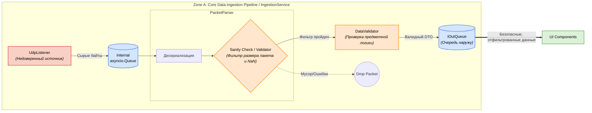

```mermaid
flowchart LR
    %% Контекст Зоны А
    subgraph CorePipeline["Zone A: Core Data Ingestion Pipeline / IngestionService"]
        direction LR
        
        UdpListener["UdpListener<br/><i>(Недоверенный источник)</i>"]
        IntQueue[("Internal<br/>asyncio.Queue")]
        
        subgraph PacketParserBlock["PacketParser"]
            direction TB
            Deserialize["Десериализация"]
            SanityCheck{"Sanity Check / Validator<br/><i>(Фильтр размера пакета и NaN)</i>"}
            Deserialize --> SanityCheck
        end
        
        DataValidator["DataValidator<br/><i>(Проверка предметной логики)</i>"]
        IOutQueue[("IOutQueue<br/><i>(Очередь наружу)</i>")]
        
        %% Связи внутри IngestionService
        UdpListener -- "Сырые байты" --> IntQueue
        IntQueue --> Deserialize
        
        SanityCheck -- "Фильтр пройден" --> DataValidator
        SanityCheck -. "Мусор/Ошибки" .-> Drop(("Drop Packet"))
        
        DataValidator -- "Валидный DTO" --> IOutQueue
    end
    
    UI["UI Components"]
    
    %% Связь наружу
    IOutQueue ==>|"Безопасные, отфильтрованные данные"| UI
    
    %% Стилизация для наглядности
    classDef untrusted fill:#f9d0c4,stroke:#e84a5f,stroke-width:2px,color:#000;
    classDef queue fill:#d4e5ff,stroke:#5c8ce6,stroke-width:2px,color:#000;
    classDef check fill:#ffe6cc,stroke:#ff9933,stroke-width:2px,color:#000;
    classDef secure fill:#dcf2d8,stroke:#66b266,stroke-width:2px,color:#000;
    
    class UdpListener untrusted;
    class IntQueue,IOutQueue queue;
    class SanityCheck,DataValidator check;
    class UI secure;
```