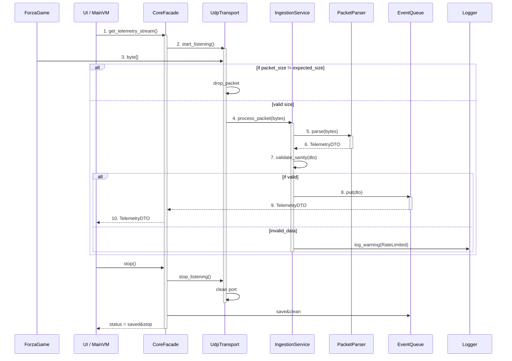

```mermaid
sequenceDiagram
    %% Участники взаимодействия
    participant Game as ForzaGame
    participant UI as UI / MainVM
    participant Facade as CoreFacade
    participant Udp as UdpTransport
    participant Ingestion as IngestionService
    participant Parser as PacketParser
    participant EQ as EventQueue
    participant Log as Logger

    %% Установка соединения
    UI->>Facade: 1. get_telemetry_stream()
    activate Facade
    Facade->>Udp: 2. start_listening()
    activate Udp
    
    %% Получение данных
    Game->>Udp: 3. byte[]
    
    %% Обработка пакета
    alt if packet_size != expected_size
        Udp->>Udp: drop_packet
    else valid size
        Udp->>Ingestion: 4. process_packet(bytes)
        activate Ingestion
        
        Ingestion->>Parser: 5. parse(bytes)
        activate Parser
        Parser-->>Ingestion: 6. TelemetryDTO
        deactivate Parser
        
        Ingestion->>Ingestion: 7. validate_sanity(dto)
        
        alt if valid
            Ingestion->>EQ: 8. put(dto)
            activate EQ
            EQ-->>Facade: 9. TelemetryDTO
            deactivate EQ
            Facade-->>UI: 10. TelemetryDTO
        else invalid_data
            Ingestion->>Log: log_warning(RateLimited)
        end
        deactivate Ingestion
    end
    
    %% Завершение работы
    UI->>Facade: stop()
    Facade->>Udp: stop_listening()
    Udp->>Udp: clean port
    deactivate Udp
    
    Facade->>EQ: save&clean
    Facade-->>UI: status = saved&stop
    deactivate Facade
```
