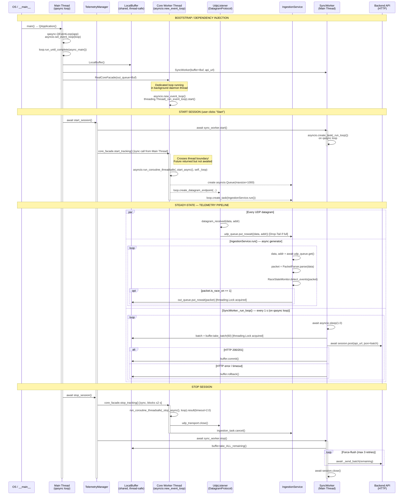

```mermaid
sequenceDiagram
    %% Участники взаимодействия
    participant OS as OS / __main__
    participant Main as Main Thread<br>(qasync loop)
    participant TM as TelemetryManager
    participant LB as LocalBuffer<br>(shared, thread-safe)
    participant CW as Core Worker Thread<br>(asyncio.new_event_loop)
    participant UDP as UdpListener<br>(DatagramProtocol)
    participant Ing as IngestionService
    participant SW as SyncWorker<br>(Main Thread)
    participant API as Backend API<br>(HTTP)

    Note over OS, API: BOOTSTRAP / DEPENDENCY INJECTION
    OS->>Main: main() → QApplication()
    activate Main
    Main->>Main: qasync.QEventLoop(app)<br>asyncio.set_event_loop(loop)
    Main->>Main: loop.run_until_complete(async_main())
    
    Main->>LB: LocalBuffer()
    Main->>SW: SyncWorker(buffer=Buf, api_url)
    Main->>CW: RealCoreFacade(out_queue=Buf)
    
    Note over CW: Dedicated loop running<br>in background daemon thread
    CW->>CW: asyncio.new_event_loop()<br>threading.Thread(_run_event_loop).start()

    Note over OS, API: START SESSION (user clicks "Start")
    Main->>TM: await start_session()
    activate TM
    
    TM->>SW: await sync_worker.start()
    activate SW
    SW->>SW: asyncio.create_task(_run_loop())<br>on qasync loop
    deactivate SW
    
    TM->>CW: core_facade.start_tracking() [sync call from Main Thread]
    activate CW
    Note right of CW: Crosses thread boundary!<br>Future returned but not awaited
    CW->>CW: asyncio.run_coroutine_threadsafe(_start_async(), self._loop)
    
    CW-->>Ing: create asyncio.Queue(maxsize=1000)
    CW-->>UDP: loop.create_datagram_endpoint(...)
    CW-->>Ing: loop.create_task(IngestionService.run())
    deactivate CW
    
    Note over OS, API: STEADY-STATE — TELEMETRY PIPELINE
    
    par Every UDP datagram
        UDP->>UDP: datagram_received(data, addr)
        UDP->>Ing: udp_queue.put_nowait((data, addr)) [Drop-Tail if full]
    and IngestionService.run() — async generator
        loop 
            Ing->>Ing: data, addr = await udp_queue.get()
            Ing->>Ing: packet = PacketParser.parse(data)
            Ing->>Ing: RaceStateMonitor.detect_events(packet)
            
            opt packet.is_race_on == 1
                Ing->>LB: out_queue.put_nowait(packet) [threading.Lock acquired]
            end
        end
    and SyncWorker._run_loop() — every 1 s (on qasync loop)
        loop
            SW->>SW: await asyncio.sleep(1.0)
            SW->>LB: batch = buffer.take_batch(60) [threading.Lock acquired]
            SW->>API: await session.post(api_url, json=batch)
            
            alt HTTP 200/201
                SW->>LB: buffer.commit()
            else HTTP error / timeout
                SW->>LB: buffer.rollback()
            end
        end
    end
    
    Note over OS, API: STOP SESSION
    Main->>TM: await stop_session()
    
    TM->>CW: core_facade.stop_tracking() [sync, blocks ≤2 s]
    activate CW
    CW->>CW: run_coroutine_threadsafe(_stop_async(), loop).result(timeout=2.0)
    CW->>UDP: udp_transport.close()
    CW->>Ing: ingestion_task.cancel()
    deactivate CW
    
    TM->>SW: await sync_worker.stop()
    activate SW
    SW->>LB: buffer.take_ALL_remaining()
    
    loop Force-flush (max 3 retries)
        SW->>API: await _send_batch(remaining)
    end
    SW->>SW: await session.close()
    deactivate SW
    
    deactivate TM
    deactivate Main
```
