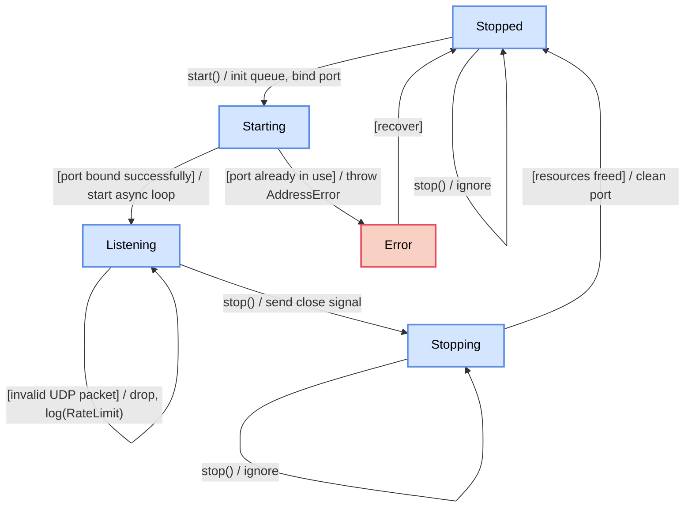

```mermaid
flowchart TB
    %% Состояния
    Stopped["Stopped"]
    Starting["Starting"]
    Listening["Listening"]
    Stopping["Stopping"]
    Error["Error"]

    %% Переходы
    Stopped -->|"start() / init queue, bind port"| Starting
    Stopped -->|"stop() / ignore"| Stopped

    Starting -->|"[port bound successfully] / start async loop"| Listening
    Starting -->|"[port already in use] / throw AddressError"| Error

    Error -->|"[recover]"| Stopped

    Listening -->|"stop() / send close signal"| Stopping
    Listening -->|"start() / ignore, log warning"| Listening
    Listening -->|"[invalid UDP packet] / drop, log(RateLimit)"| Listening

    Stopping -->|"[resources freed] / clean port"| Stopped
    Stopping -->|"stop() / ignore"| Stopping

    %% Стилизация классов (с черным текстом)
    classDef stateNode fill:#d4e5ff,stroke:#5c8ce6,stroke-width:2px,color:#000;
    classDef errorNode fill:#f9d0c4,stroke:#e84a5f,stroke-width:2px,color:#000;

    class Stopped,Starting,Listening,Stopping stateNode;
    class Error errorNode;
```