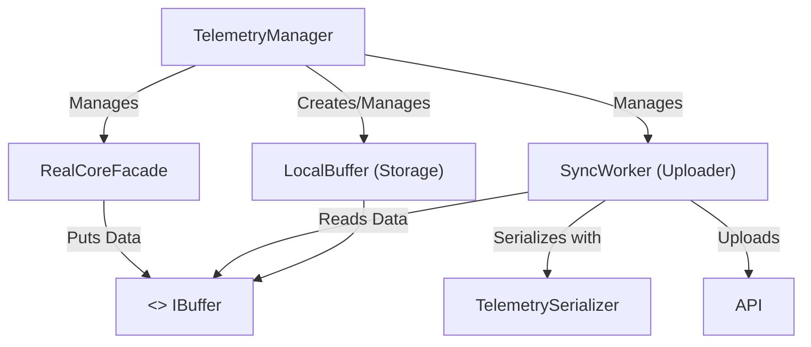

# Backend Sync Components Overview

## Component Brief:
*   **Telemetry Manager:** The main hub. Orchestrates the entire process (starts sessions, initializes storage, stops sessions). It is responsible for injecting concrete implementations (e.g., `LocalBuffer`), while ensuring that components communicate strictly through interfaces like `IBuffer`.
*   **Real Core Facade:** Continuously pulls telemetry data directly from the game.
*   **IBuffer (Interface):** The abstraction that defines data storage operations, enabling dependency inversion.
*   **Local Buffer:** Concrete implementation of `IBuffer` that holds data in RAM.
*   **Sync Worker:** Retrieves data from the buffer, performs serialization, and transmits it to the server.
*   **Telemetry Serializer:** Component responsible for converting internal Data Transfer Objects (DTOs) into the format required by the API.
*   **API:** The final destination (cloud server) where all telemetry data is stored and processed.
