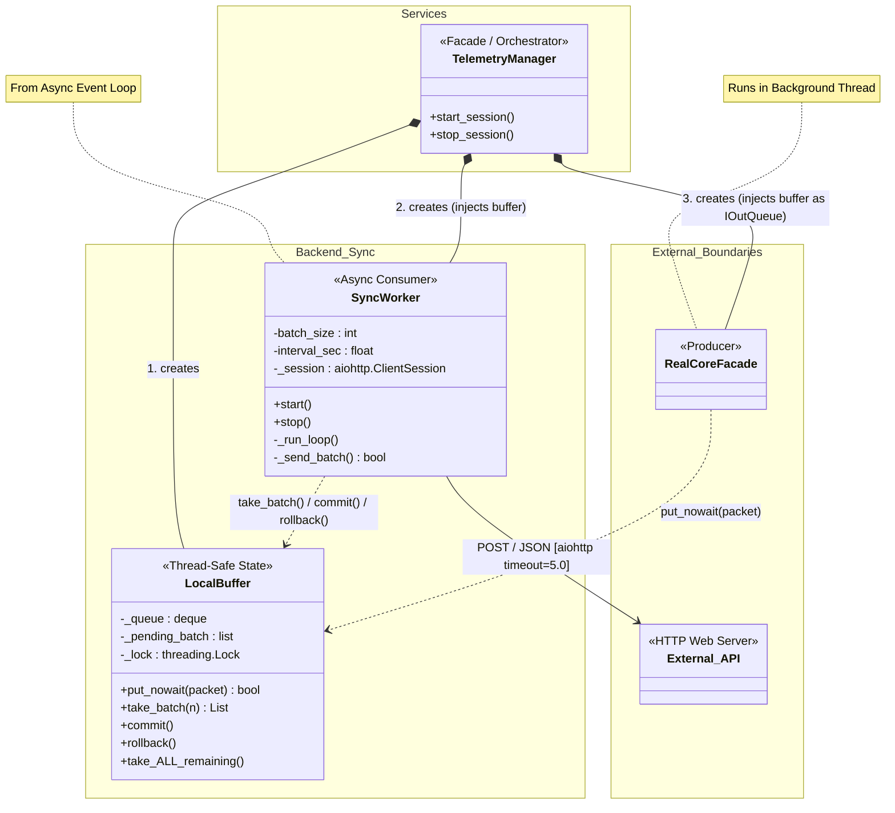

# Архитектура Backend Sync (Компоненты)

В данном документе описана архитектура модуля синхронизации (Backend Sync), который отвечает за потокобезопасную буферизацию и отправку пакетов телеметрии на удаленный сервер в фоновом режиме.

## Основные Компоненты

### 1. TelemetryManager (Оркестратор)
- Выступает в качестве входной точки (Facade) для всего процесса записи телеметрии.
- Создаёт необходимые для работы инстансы: инициализирует потокобезопасный `LocalBuffer`, передаёт (инжектит) его фасадным классам (как `IOutQueue` для ядра) и в рабочий класс `SyncWorker`.
- Управляет запуском и остановкой процессов (`start_session` / `stop_session`).

### 2. LocalBuffer (Потокобезопасное Хранилище)
- Ядро процесса синхронизации. Этот компонент безопасно (с помощью блокировок `threading.Lock`) связывает многопоточный и асинхронный миры приложения.
- **`put_nowait()`**: Добавляет новый пакет в конец очереди (`_queue`). Это вызывает `Producer`.
- **`take_batch(n)`**: Выбирает из начала очереди порцию данных (не более `n`) и временно сохраняет их во внутреннем списке `_pending_batch` на случай сбоев в сети.
- **Гарантия доставки**: После успешной сетевой отправки вызывается `commit()`, который навсегда удаляет сохранённые пакеты из памяти. При возникновении сетевой ошибки (тайм-аут и т. п.) вызывается `rollback()`, и пакеты из `_pending_batch` возвращаются обратно в начало `_queue` для повторной отправки.

### 3. SyncWorker (Асинхронный Отправитель)
- Выполняется как отдельная задача в рамках `asyncio` Event Loop приложения.
- Раз в `interval_sec` секунд "просыпается" и запрашивает пакеты из буфера.
- Собирает до `batch_size` пакетов и объединяет в один JSON payload (Массовая отправка для снижения нагрузки на сеть).
- Управляет сессией `aiohttp.ClientSession`, выполняя HTTP POST к внешнему `External_API`.

## Паттерн Producer-Consumer (Поток данных)

Модуль Sync строго следует паттерну Производитель-Потребитель:
1. **Producer (`RealCoreFacade`)**: Независимый системный поток (Thread), который очень быстро извлекает телеметрию из UDP и безостановочно складывает (`put_nowait`) пакеты в буфер.
2. **Buffer (`LocalBuffer`)**: Центральный узел, гасящий всплески активности. Изолирует Producer от Consumer при помощи блокировок.
3. **Consumer (`SyncWorker`)**: Асинхронная задача (Coroutine), не блокирующая основной цикл программы. Забирает данные пачками (отсюда и методы commit/rollback) и отвечает за медленные сетевые операции (HTTP-таймауты доходят до 5 секунд).
