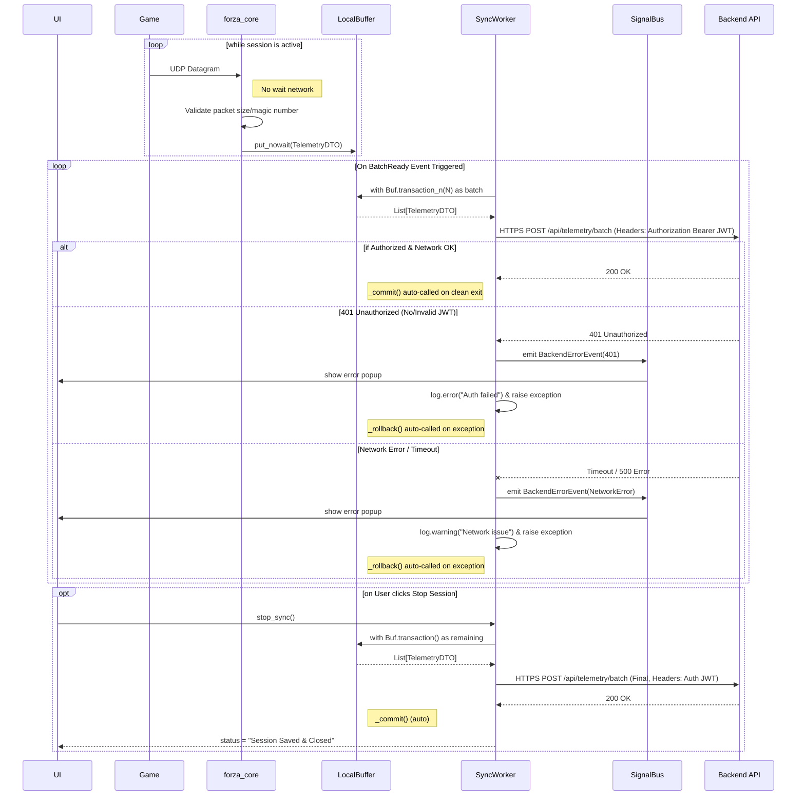

# Data Flow Process

## How it works:
1. The game constanty streams **UDP Datagrams**, which are processed by `forza_core` and immediately stored in the **LocalBuffer**.
2. The **SyncWorker** periodically takes a batch of data and attempts to send it to the **Backend API**.
3. If the connection fails, data remains in the buffer.
4. When the session is stopped, all remaining data is force-synced to ensure no loss.

## Security & Logging
> [!CAUTION]
> **Архитектурное правило безопасности:** Все логирующие компоненты (и особенно `SyncWorker`), взаимодействующие с API, обязаны использовать фильтр (например, `logging.Filter`), который по регулярному выражению заменяет токены в заголовке `Authorization: Bearer ...` на `***`. Это исключает риск утечки JWT в файлы логов.

## Transport
HTTPS POST батчами (batches) является утвержденным и оптимальным транспортом для текущей архитектуры (stateless backend). Данный подход минимизирует количество HTTP-запросов и обеспечивает надежную передачу телеметрии.

