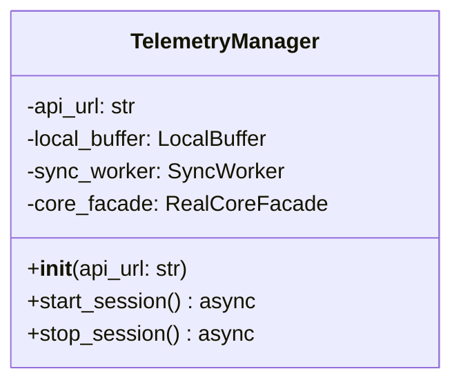

# Class: TelemetryManager

The `TelemetryManager` is a high-level **Orchestrator** (Facade) designed to hide the complexity of the telemetry pipeline from the UI. It manages the lifecycle of a race session.

## Core Responsibilities

1. **Initialization:** Instantiates and connects `LocalBuffer`, `SyncWorker`, and `RealCoreFacade`.
2. **Lifecycle Control:** Provides simple `async` methods to start and stop the entire data pipeline.
3. **Dependency Injection:** Passes the `TelemetrySerializer` instance to the `SyncWorker`, delegating the responsibility of data mapping.

## Class Definition

## Methods Detail

### `__init__(api_url: str)`
Configures the environment. It is the only place where the concrete implementations are wired together.
- Creates `LocalBuffer`.
- Creates `SyncWorker` and passes the buffer + `TelemetrySerializer` instance.
- Creates `RealCoreFacade` and passes the buffer as `out_queue`.

### `start_session() -> None`
**Async.** Sequentially activates the pipeline:
1. Starts the `SyncWorker` background loop.
2. Signal `RealCoreFacade` to begin UDP tracking.

### `stop_session() -> None`
**Async.** Ensures a **Zero Data Loss** shutdown:
1. Stops `RealCoreFacade` (no new data enters).
2. Triggers `sync_worker.stop()`, which performs a final "force flush" of the `LocalBuffer` to the API.

---

> [!NOTE]
> For a high-level overview of how data flows through these components, refer to [02_Data_Flow.md](file:///d:/ForzaAITuner/docs/03_Backend_Sync_Temp/02_Data_Flow.md).
