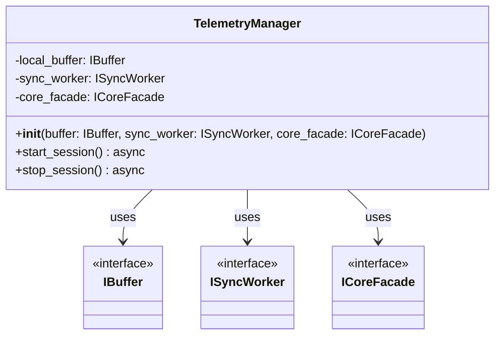

# Class: TelemetryManager

The `TelemetryManager` is a high-level **Orchestrator** (Facade) designed to hide the complexity of the telemetry pipeline from the UI. It manages the lifecycle of a race session.

## Core Responsibilities

1. **Lifecycle Control:** Provides simple `async` methods to start and stop the entire data pipeline.
2. **Dependency Injection:** Relies on abstractions (`IBuffer`, `ISyncWorker`, `ICoreFacade`) passed via its constructor, adhering to the Dependency Inversion Principle (DIP). This allows for easier testing and decouples the manager from specific implementations.

## Class Definition

## Methods Detail

### `__init__(buffer: IBuffer, sync_worker: ISyncWorker, core_facade: ICoreFacade)`
Validates and assigns the provided abstractions. 
By delegating component creation up to the Composition Root (`main.py`), `TelemetryManager` no longer violates the Single Responsibility Principle or DIP.

### `start_session() -> None`
**Async.** Sequentially activates the pipeline:
1. Starts the `SyncWorker` background loop.
2. Signal `RealCoreFacade` to begin UDP tracking.

### `stop_session() -> None`
**Async.** Ensures a **Zero Data Loss** shutdown:
1. Stops `RealCoreFacade` (no new data enters).
2. Triggers `sync_worker.stop()`, which performs a final "force flush" of the `LocalBuffer` to the API.

---

> [!NOTE]
> For a high-level overview of how data flows through these components, refer to [02_Data_Flow.md](02_Data_Flow.md).
