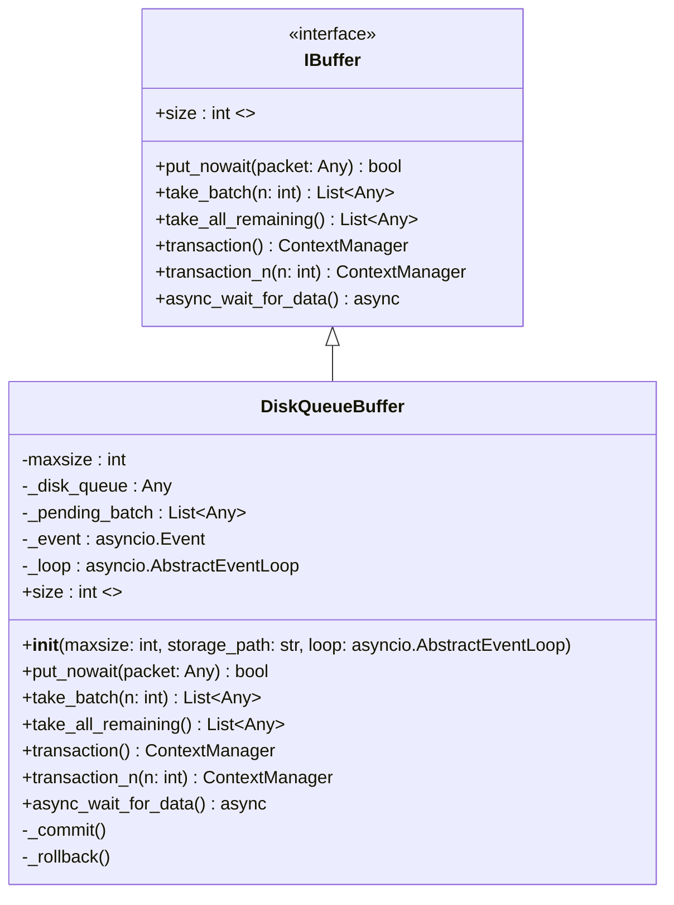

# Class: DiskQueueBuffer (IBuffer Implementation)

The `DiskQueueBuffer` is a **thread-safe** disk-backed storage designed to decouple high-speed telemetry intake from the relatively slow network synchronization process. It implements a **Transaction Pattern** to ensure data integrity during transmission failures.

## Storage Strategy (RAM vs Disk)

To protect against critical data loss during application crashes, Out-Of-Memory (OOM) errors, or unexpected restarts, the buffer uses **persistent disk storage** instead of volatile RAM. By adopting this **Single Source of Truth (SSOT)** approach, the disk queue becomes the only source of truth. There is no longer a risk of losing data due to packets getting stuck in an in-memory queue during a sudden program termination.

We deliberately avoid heavyweight relational databases like SQLite to minimize I/O overhead and locking contention during high-frequency telemetry writes (e.g., 60Hz). Instead, we use a dedicated disk queuing solution (such as the `diskcache` library or a lightweight Append-Only WAL/JSONL file). 

> [!TIP]
> **Implementation Recommendation:** Consider using the `diskcache` library for `DiskQueueBuffer`. It is pure Python, uses SQLite under the hood for metadata, supports transactions "out of the box," and is extremely fast for these use cases.

This guarantees that any un-synced telemetry remains securely on disk and is automatically resumed for upload the next time the application starts.

## Class Definition



## Core Features

### 1. Thread Safety & Concurrency
Thread safety between the **`forza_core`** (synchronous telemetry intake thread) and the **`SyncWorker`** (asyncio loop) is guaranteed by the underlying disk queue library. This architecture eliminates the need for manual `threading.Lock` management that could stall or block the main game telemetry event loop.

### 2. Transactional Mechanism
To prevent data loss during network errors, the buffer uses a robust "Pending Batch" approach. Since reading from a disk queue might normally dequeue and remove the item, we enforce transactions:
- **`take_batch(n)`**: Peeks or transfers up to `n` items from the disk queue into the in-memory `_pending_batch`.
- **`_commit()`**: Clears the `_pending_batch` once the upload is confirmed successful (completing the transaction and permanently evicting items from the disk).
- **`_rollback()`**: Moves items from `_pending_batch` **back** to the head of the disk queue if the upload fails, guaranteeing they are the first to be retried on the next sync attempt.

### 3. Context Managers (Recommended Usage)
The most reliable way to interact with the buffer is via transaction context managers:

```python
# Automatic commit on success, rollback on exception
with buffer.transaction_n(batch_size) as batch:
    send(batch) 
```

## Methods Detail

| Method | Description |
| :--- | :--- |
| `put_nowait(packet)` | Synchronously writes the packet to the disk queue. It then calls `loop.call_soon_threadsafe(self._event.set)` as an absolutely thread-safe way to wake up the async worker from the synchronous thread. |
| `take_batch(n)` | Retrieves a specific number of packets and marks them as "in-flight" in the pending batch. |
| `take_all_remaining()` | Used during shutdown to grab every single packet left. |
| `transaction()` | A context manager that wraps `take_all_remaining()`. |
| `transaction_n(n)` | A context manager that wraps `take_batch(n)`. |
| `async_wait_for_data()` | Awaits `self._event.wait()` (under the hood), completely hiding the async event loop details from the worker. |

---

> [!IMPORTANT]
> A `maxsize` parameter is strictly enforced to ensure the disk queue acts as a **Ring Buffer**. If the network goes down and the game continues sending data, older records will be cyclically overwritten by new ones. This guarantees the application will never trigger a "No space left on device" error.
> 
> **Resilience & Atomicity:**
> - Ensure that Ring Buffer operations (deleting or overwriting old batches) are **atomic** to protect the cache from corruption during sudden power loss.
> - Do not let disk-specific exceptions (`IOError`, etc.) leak out of `DiskQueueBuffer`. Wrap them in custom **Domain Exceptions** to maintain clean encapsulation and protect the `IBuffer` interface.
