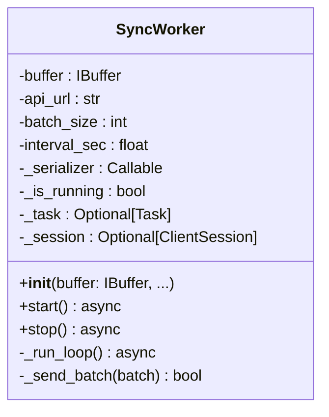

# Class: SyncWorker

The `SyncWorker` is a background consumer that periodically takes data from an `IBuffer` implementation and uploads it to the backend via HTTP. It is decoupled from the storage implementation, relying solely on the interface contract.

## Class Definition

## Operational Logic

### 1. The Async Loop (`_run_loop`)
The worker executes an infinite loop as long as `_is_running` is true.
- The worker calls `await buffer.async_wait_for_data()`, depending entirely on the abstract waiting mechanism with no knowledge of the underlying `asyncio.Event`.
- Once woken up, it MUST clear the ready flag (`event.clear()`) and then retrieves the data via `await asyncio.to_thread(buffer.take_batch, n)` (this can also be wrapped seamlessly with `transaction_n()`).
- **Resilience Tip:** Always wrap `buffer.take_batch` (or the transaction) in a `try...except` block. If the disk is momentarily locked by an antivirus or the OS, the worker must log the error and stay alive for the next cycle instead of crashing.
- Using `asyncio.to_thread` here is critically important: it ensures that synchronous disk reads do not freeze the Event Loop, representing the modern standard for mixing sync file I/O and async network code.
- If the HTTP request fails, the transaction will perform a `rollback` within the `IBuffer`.
- The entire process repeats as data continues to accumulate.

### 2. Dependency Inversion (SRP)
The `SyncWorker` does not know "how" to serialize the telemetry. It receives a `serializer` function during initialization.
- **Goal:** This allows the networking logic to remain stable even if the telemetry data structure changes.

### 3. Graceful Shutdown & Force Flush
When the `stop()` method is called:
- The background loop is cancelled.
- The worker enters a **"Final Sync"** mode.
- It performs up to **3 retries** to upload ALL remaining items in the `IBuffer` storage.
- Only after the buffer is flushed (or retries are exhausted) does it close the `aiohttp.ClientSession`.

## Key Methods

| Method | Role |
| :--- | :--- |
| `__init__(buffer: IBuffer, ...)` | **Crucial:** Expects an `IBuffer` implementation. This ensures the worker can work with any storage (RAM, Disk, etc.) as long as it follows the contract. |
| `start()` | Initializes the `ClientSession` and spawns the `_run_loop` task. |
| `_send_batch()` | Performs the `POST` request. Returns `True` if HTTP status is 200/201. |
| `stop()` | Signals the loop to terminate and initiates the final data flush. |

---

> [!TIP]
> The `SyncWorker` is designed to be **highly resilient**. If the API is offline, the worker will continue to log warnings and rollback data into the buffer, waiting for the connection to recover.

