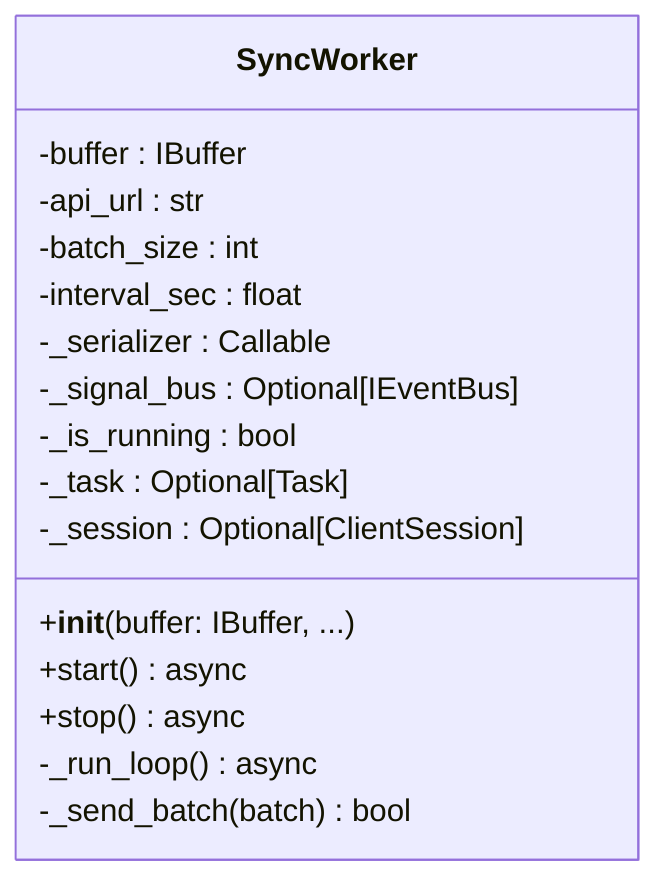

# Class: SyncWorker

The `SyncWorker` is a background consumer that periodically takes data from an `IBuffer` implementation and uploads it to the backend via HTTP. It is decoupled from the storage implementation, relying solely on the interface contract.

## Class Definition

## Operational Logic

### 1. The Async Loop (`_run_loop`)
The worker executes a loop as long as `_is_running` is true.
- The worker waits for new data (traditionally via `await asyncio.sleep()` or a more advanced waiting mechanism like `await buffer.async_wait_for_data()`).
- Once ready, it retrieves data using the **`with buffer.transaction_n(batch_size) as batch:`** context manager. This ensures automatic commit on successful network responses and automatic rollback on any failures or exceptions.
- **Resilience Tip:** If an error occurs during the network request, the context manager triggers `_rollback()`, returning the "in-flight" items to the head of the queue for the next retry attempt.
- Using `asyncio.to_thread` is appropriate if the buffer implementation performs heavy synchronous disk I/O, ensuring the Event Loop remains responsive.
- The entire process repeats as long as the session is active.

### 2. Dependency Inversion (SRP)
The `SyncWorker` does not know "how" to serialize the telemetry or how to communicate with the UI. 
- It receives a `serializer` function during initialization for data manipulation.
- It receives a `IEventBus` via constructor injection to asynchronously dispatch `BackendErrorEvent`s securely to the presentation layer without coupling.
- **Goal:** This allows the networking logic to remain stable even if the telemetry data structure changes, and allows thread-safe UI error reporting.

### 3. Graceful Shutdown & Force Flush
When the `stop()` method is called:
- The background loop is cancelled.
- The worker enters a **"Final Sync"** mode.
- It performs up to **3 retries** to upload ALL remaining items in the `IBuffer` storage.
- Only after the buffer is flushed (or retries are exhausted) does it close the `aiohttp.ClientSession`.

## Key Methods

| Method | Role |
| :--- | :--- |
| `__init__(buffer: IBuffer, ...)` | **Crucial:** Expects an `IBuffer` implementation and an optional `IEventBus`. Ensures decoupled storage and decoupled UI error reporting. |
| `start()` | Initializes the `ClientSession` and spawns the `_run_loop` task. |
| `_send_batch()` | Performs the `POST` request. Returns `True` if HTTP status is 200/201. |
| `stop()` | Signals the loop to terminate and initiates the final data flush. |

---

> [!TIP]
> The `SyncWorker` is designed to be **highly resilient**. If the API is offline, the worker will continue to log warnings and rollback data into the buffer, waiting for the connection to recover.

