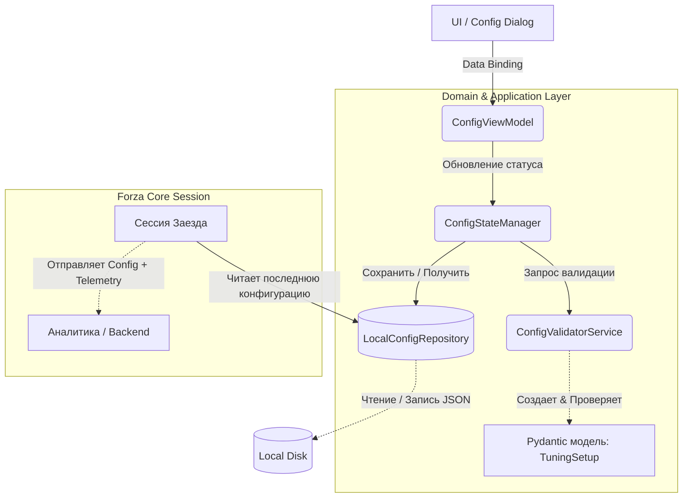
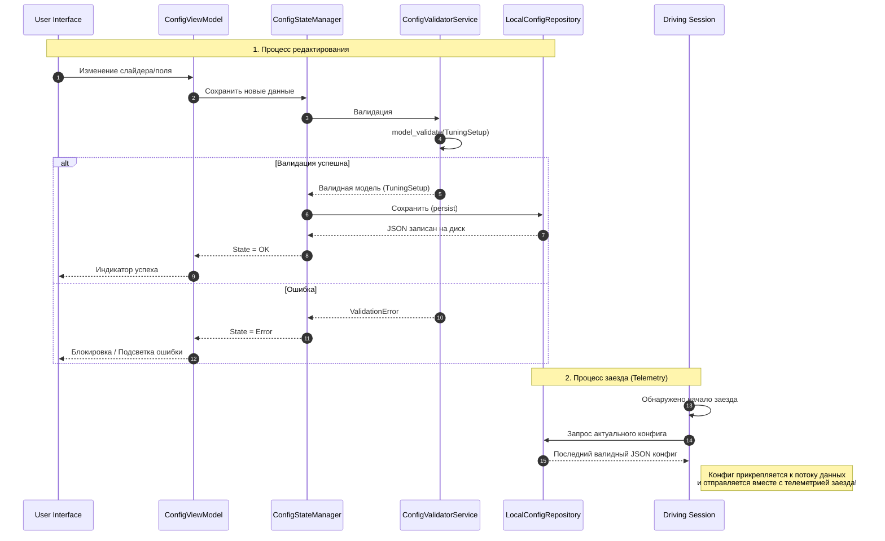

# Менеджмент Конфигураций (Domain/Application Layer)

В то время как UI слой отвечает за отображение и сбор данных, бизнес-логика валидации, сохранения и переиспользования конфигураций инкапсулирована в Domain и Application слоях. 

Этот документ описывает как происходит управление состоянием конфигурации (настроек автомобиля), ее сохранение и как она встраивается в процесс сбора телеметрии во время заездов.

## Архитектура Управления Состоянием (Config State Management)

Ниже представлена структурная схема взаимодействия компонентов при изменении и использовании конфигурации:

### Основные компоненты системы:

1. **ConfigViewModel**
   - Точка входа для UI. Принимает сырые данные из формы.
   - Абстрагирует UI от прямой работы с сервисами.
   
2. **ConfigStateManager**
   - Управляет жизненным циклом конфигурации в памяти.
   - Оркестрирует процессы валидации и сохранения. Является единственным источником истины о текущем валидном конфиге.

3. **ConfigValidatorService**
   - Отвечает за проверку бизнес-правил.
   - Использует строгую типизацию и ограничения Pydantic модели `TuningSetup` (например, проверка диапазонов через `ge/le`, проверка допустимых типов машин).

4. **LocalConfigRepository**
   - Инфраструктурный слой. Отвечает за персистентность (сохранение на диск).
   - Читает и записывает данные настройки в формате JSON (например, файл `current_setup.json`). 
   - **Главное правило**: *Последняя валидная конфигурация всегда хранится локально*. Это сделано для удобства пользователя, чтобы после перезапуска приложения не приходилось вводить все заново.

## Жизненный Цикл и Использование в Сессии Заезда

Помимо локального сохранения для удобства, конфигурация является критически важной частью данных заезда.

### Идея связи Конфига с Телеметрией:
Как только начинается активная сессия в игре (старт телеметрии):
1. Ядро приложения (`Forza Core`) читает последнюю валидную конфигурацию через `LocalConfigRepository`.
2. Эта конфигурация неразрывно прикрепляется к данным сессии.
3. Таким образом, вся телеметрия данного заезда имеет точный слепок того, с какими настройками (подвеска, давление, аэродинамика) ехала машина.
