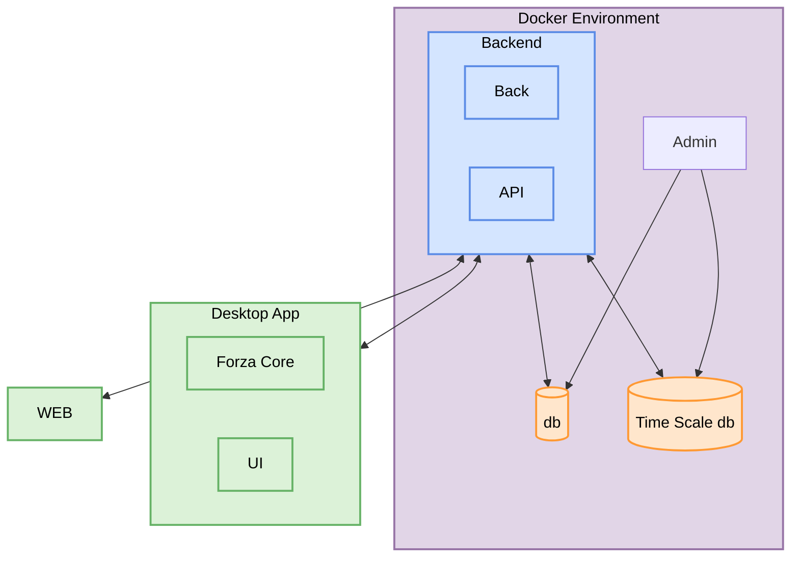

```mermaid
flowchart TB
    subgraph Docker["Docker Environment"]
        direction TB
        
        subgraph BackendGroup["Backend"]
            direction LR
            Back["Back"]
            API["API"]
        end
        
        TSDB[("Time Scale db")]
        PgDB[("db")]
        Admin["Admin"]
        
        %% Внутренние связи внутри Docker
        BackendGroup <--> TSDB
        BackendGroup <--> PgDB
        
        Admin --> TSDB
        Admin --> PgDB
    end
    
    subgraph DesktopApp["Desktop App"]
        direction LR
        Core["Forza Core"]
        UI["UI"]
    end
    
    WEB["WEB"]
    
    %% Внешние связи
    BackendGroup <--> DesktopApp
    BackendGroup <--> WEB

    %% Стилизация
    classDef container fill:#e1d5e7,stroke:#9673a6,stroke-width:2px,color:#000;
    classDef backend fill:#d4e5ff,stroke:#5c8ce6,stroke-width:2px,color:#000;
    classDef db fill:#ffe6cc,stroke:#ff9933,stroke-width:2px,color:#000;
    classDef client fill:#dcf2d8,stroke:#66b266,stroke-width:2px,color:#000;

    class Docker container;
    class BackendGroup,Back,API backend;
    class TSDB,PgDB db;
    class DesktopApp,Core,UI,WEB client;
```
