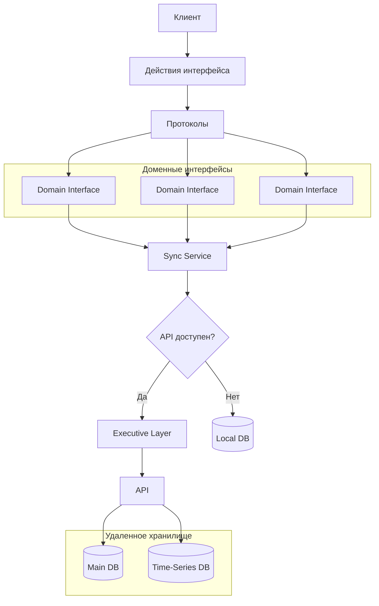
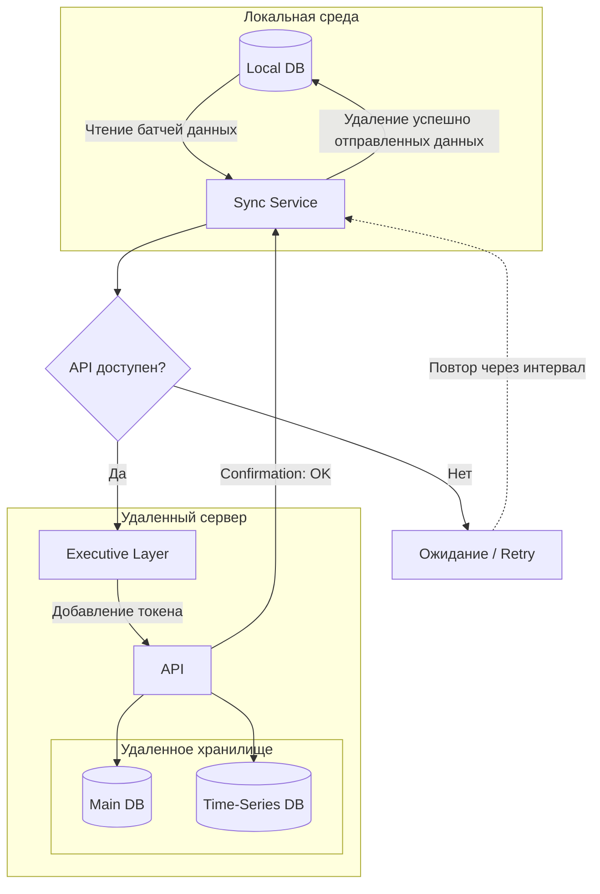

# Архитектура и синхронизация данных

## Типы баз данных
*   **Main DB (Удаленная)**: Реляционная БД для метаданных, настроек и сессий.
*   **Time-Series DB (Удаленная)**: Специализированное хранилище для высокочастотной телеметрии.
*   **Local DB (Устройство)**: Буфер для оффлайн-режима и минимизации сетевой нагрузки.

# Схема взаимодействия

## Описание компонентов

### 1. Клиент и доменный слой
*   **Клиент**: Приложение или пользователь, инициирующий взаимодействие.
*   **Действия и Протоколы**: Логика обработки сигналов клиента и распределение их по соответствующим доменным интерфейсам.
*   **Доменные интерфейсы**: Бизнес-логика приложения. Интерфейсы, через которые проходят данные прежде чем попасть в систему синхронизации и хранения.

### 2. Sync Service
Управляет маршрутизацией данных в зависимости от состояния сети.
1.  **Connection Checker**: Мониторит состояние сетевого подключения через системные API (Network Connectivity Manager) и инициирует проверку доступности API только при появлении сети.
2.  **Ветвление**:
    *   **ONLINE**: Данные передаются в **Executive Layer** для авторизации (JWT/OAuth) и далее в **API**.
    *   **OFFLINE**: Данные сохраняются в **Local DB** для последующей синхронизации.

### 3. Сервисные слои
*   **Connection Checker**: Сервис мониторинга доступности API. Не использует постоянный опрос (polling); вместо этого подписывается на события операционной системы (Android/iOS/OS Connectivity Manager) и инициирует проверку ("пинг") только тогда, когда ОС сообщает о восстановлении соединения.
*   **Executive Layer**: Слой безопасности и авторизации. Прикрепляет JWT/OAuth токены ко всем исходящим запросам к API.
*   **Local DB**: Локальное хранилище для работы в оффлайн-режиме.

### 4. API и Удаленные базы данных
*   **API**: Централизованный сервис для взаимодействия с серверными хранилищами.
*   **Main DB**: Реляционная база данных для метаданных, настроек и сущностей.
*   **Time-Series DB**: Специализированная база данных для высокочастотной телеметрии.

---

# Механизм фоновой синхронизации

Процесс описывает, как данные, накопленные в **Local DB** во время офлайн-режима, переносятся на сервер через **Sync Service**.

## Логика фоновой синхронизации

1.  **Триггер**: **Sync Service** (Background Worker) работает в фоновом режиме.
2.  **Извлечение**: Считываются накопленные пакеты данных из **Local DB**.
3.  **Проверка**: **Connection Checker** ожидает сигнал от ОС о наличии сетевого интерфейса и затем проверяет доступность **API**.
    *   Если сервер недоступен, сервис переходит в режим ожидания. Используется паттерн **Exponential Backoff with Jitter** (экспоненциальная задержка со случайным разбросом). Это предотвращает одновременную атаку на сервер ("thundering herd" effect) всеми клиентами сразу после восстановления связи.
4.  **Передача**: При наличии связи данные проходят через **Executive Layer** и отправляются в **API**.
5.  **Очистка (Ack/Nack)**: После получения подтверждения от **API** (`Confirmation: OK`), **Sync Service** удаляет отправленные записи из **Local DB**. Это реализует паттерн гарантированной доставки **At-Least-Once**.
6.  **Идемпотентность и обработка сбоев**:
    *   Транзакции в **Main DB** и **TSDB** идемпотентны.
    *   Если **API** вернет ошибку (например, `500 Internal Server Error` из-за таймаута балансировщика), но данные уже успели записаться в базу, **Sync Service** не получит подтверждения и отправит их повторно.
    *   **API** обрабатывает такие дубликаты по уникальному **UUID** записи или пакета, предотвращая двойную запись.
7.  **Защита от перегрузок**: 
    *   **На стороне API**: Применяется жесткий **Rate Limiting** (ограничение количества запросов в секунду).
    *   **На стороне клиента**: Введено ограничение размера одного **батча**. 
    *   Это предотвращает сценарии, когда клиент после долгого отсутствия (например, неделю в офлайне) пытается выгрузить гигабайт данных за секунду, фактически совершая DDoS-атаку на сервер.

