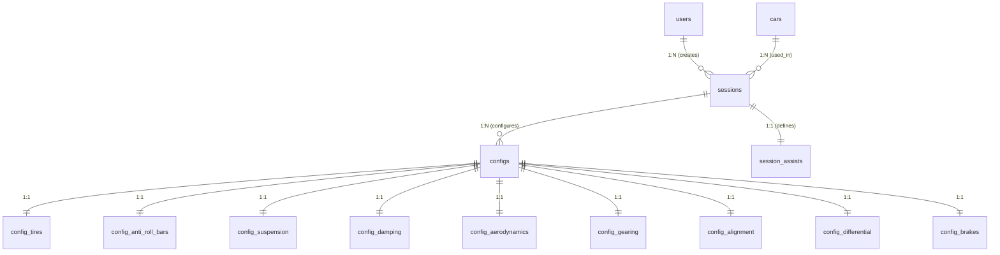

# Структура Базы Данных
Этот документ описывает улучшенную схему основной базы данных, спроектированную с учетом принципов SOLID, безопасности и требований к масштабируемости.

## Схема отношений (ER)
Высокоуровневая структура связей без детализации полей.

### Таблица связей

| Родительская таблица | Связь | Дочерняя таблица | Описание |
| :--- | :---: | :--- | :--- |
| `users` | 1:N | `sessions` | Пользователь создает множество сессий (заездов). |
| `cars` | 1:N | `sessions` | Один автомобиль может участвовать во многих заездах. |
| `sessions` | 1:N | `configs` | В рамках одного заезда может быть создано несколько версий настроек. |
| `sessions` | 1:1 | `session_assists` | Помощники закрепляются за конкретной сессией. |
| `configs` | 1:1 | `config_...` | Группа из 9 таблиц, расширяющих базовый `configs` (Tires, Suspension, etc.). |

---

## Список таблиц (Описание)

| Таблица | Описание |
| :--- | :--- |
| **`users`** | Хранит учетные данные пользователей и хеши паролей. |
| **`cars`** | Справочник характеристик автомобилей из Forza Horizon. |
| **`sessions`** | Связывает пользователя, машину и условия заезда (трасса, погода). |
| **`session_assists`** | Настройки помощи (ABS, TCS, Steering), используемые в сессии. |
| **`configs`** | Базовые характеристики машины (вес, мощность) для расчета тюнинга. |
| **`config_tires`** | Настройки давления и параметров шин. |
| **`config_anti_roll_bars`** | Параметры переднего и заднего стабилизаторов. |
| **`config_suspension`** | Жесткость пружин и высота дорожного просвета. |
| **`config_damping`** | Настройки амортизаторов (отскок и сжатие). |
| **`config_aerodynamics`** | Прижимная сила передних и задних элементов. |
| **`config_gearing`** | Передаточные числа трансмиссии (JSONB массив для гибкости). |
| **`config_alignment`** | Углы развала, схождения и кастера. |
| **`config_differential`** | Настройки блокировки дифференциала. |
| **`config_brakes`** | Баланс и давление тормозной системы. |

---

---

## 1. Таблица `users` (Пользователи)
Хранит данные учетных записей.

| Поле | Тип | Описание |
| :--- | :--- | :--- |
| `id` | UUID (v4/v7) | Первичный ключ (защита от IDOR). |
| `username` | String | Уникальное имя пользователя. |
| `email` | String | Уникальный email. |
| `password_hash`| String | Хеш пароля с солью (Argon2 / BCrypt). |
| `created_at` | TIMESTAMPTZ | Время регистрации (с таймзоной). |
| `updated_at` | TIMESTAMPTZ | Время последнего обновления профиля. |

## 2. Таблица `cars` (Автомобили)
Нормализованный справочник автомобилей.

| Поле | Тип | Описание |
| :--- | :--- | :--- |
| `id` | UUID | Суррогатный первичный ключ. |
| `forza_ordinal`| Integer | Уникальный ID из игры (UNIQUE, NOT NULL). |
| `name` | String | Марка и модель (NOT NULL). |
| `engine_placement`| String | Расположение двигателя (Mid, Front, Rear). |

## 3. Таблица `sessions` (Заезды)
Связующая сущность между пользователем, машиной и результатами.

| Поле | Тип | Описание |
| :--- | :--- | :--- |
| `id` | UUID (v4/v7) | Идентификатор сессии. |
| `user_id` | UUID (FK) | Владелец сессии (Index: B-Tree). |
| `car_id` | UUID (FK) | Выбранный автомобиль (Index: B-Tree). |
| `name` | String | Название сессии (Напр. "Drift Setup", "S1 Road"). |
| `location` | String | Локация или тип трассы. |
| `surface` | String | Тип поверхности (Asphalt, Dry). |
| `road_type` | String | Целевое покрытие. |
| `created_at` | TIMESTAMPTZ | Время записи. |

> [!IMPORTANT]
> **SRP (Single Responsibility):** Название машины (`car string`) удалено из таблицы сессий. Информация о машине получается через `JOIN` с таблицей `cars` по `car_id`.

### 3.1 Таблица `session_assists` (Помощники)
Настройки сложности и помощи, действующие в рамках сессии. Привязаны 1-to-1 к сессии.

| Поле | Тип | Описание |
| :--- | :--- | :--- |
| `session_id` | UUID (PK, FK) | Идентификатор сессии. |
| `abs` | Boolean | Система ABS. |
| `stm` | Boolean | Контроль устойчивости. |
| `tcs` | Boolean | Антипробуксовочная система. |
| `shifting` | String | Тип переключения передач. |
| `steering` | String | Режим руления. |

## 4. Группа таблиц `configs` (Настройки тюнинга)
Для повышения модульности и оптимизации запросов, параметры разделены на базовую таблицу и специализированные блоки (1-to-1).

### 4.1 Таблица `configs` (Базовая информация)
Хранит основные характеристики и настройки, которые всегда загружаются вместе с сессией.

| Поле | Тип | Описание |
| :--- | :--- | :--- |
| `id` | UUID | Первичный ключ. |
| `session_id` | UUID (FK) | Ссылка на сессию. **ON DELETE CASCADE**. |
| `created_at` | TIMESTAMPTZ | Дата создания. |
| `updated_at` | TIMESTAMPTZ | Дата изменения. |
| **Характеристики (Inputs)** | | |
| `weight`, `power`, `torque` | Integer | Характеристики автомобиля для расчета. |
| `front_weight` | Float | Развесовка (0.0 - 100.0). |
| `suspension_travel` | Integer | Ход подвески (мм). |
| `drive_type` | String | Привод (AWD, FWD, RWD). |
| `class_pi` | Integer | PI рейтинг (100-999). Moved from session. |

### 4.2 Таблица `config_tires` (Шины)
Связь 1-to-1 с `configs.id`. Позволяет загружать данные шин отдельно.

| Поле | Тип | Описание |
| :--- | :--- | :--- |
| `config_id` | UUID (PK, FK) | Идентификатор конфига. |
| `front_pressure_bar`, `rear_pressure_bar` | Float | Давление (bar). |
| `width_front`, `width_rear` | Integer | Ширина шин. |
| `compound` | String | Тип резины. |

### 4.3 Таблица `config_anti_roll_bars` (Стабилизаторы)
Связь 1-to-1 с `configs.id`. Соответствует модели `AntiRollBars`.

| Поле | Тип | Описание |
| :--- | :--- | :--- |
| `config_id` | UUID (PK, FK) | Идентификатор конфига. |
| `front` | Float | Передний стабилизатор. |
| `rear` | Float | Задний стабилизатор. |

### 4.4 Таблица `config_suspension` (Подвеска)
Связь 1-to-1 с `configs.id`. Пружины и клиренс. Соответствует модели `Suspension`.

| Поле | Тип | Описание |
| :--- | :--- | :--- |
| `config_id` | UUID (PK, FK) | Идентификатор конфига. |
| `spring_front`, `spring_rear` | Float | Пружины (жесткость). |
| `spring_min`, `spring_max` | Float | Минимальная/Максимальная жесткость. |
| `clearance_front`, `clearance_rear` | Float | Клиренс. |
| `clearance_min`, `clearance_max` | Float | Границы клиренса. |

### 4.5 Таблица `config_damping` (Амортизация)
Связь 1-to-1 с `configs.id`. Настройки отскока и сжатия. Соответствует модели `Damping`.

| Поле | Тип | Описание |
| :--- | :--- | :--- |
| `config_id` | UUID (PK, FK) | Идентификатор конфига. |
| `rebound_front`, `rebound_rear` | Float | Отскок (rebound). |
| `rebound_min`, `rebound_max` | Float | Границы отскока. |
| `bump_front`, `bump_rear` | Float | Сжатие (bump). |
| `bump_min`, `bump_max` | Float | Границы сжатия. |

### 4.6 Таблица `config_aerodynamics` (Аэродинамика)
Связь 1-to-1 с `configs.id`. Загружается только если у машины есть аэродинамические элементы.

| Поле | Тип | Описание |
| :--- | :--- | :--- |
| `config_id` | UUID (PK, FK) | Идентификатор конфига. |
| `front`, `rear` | Float | Прижимная сила (кг). |
| `front_min`, `front_max` | Float | Границы прижима (перед). |
| `rear_min`, `rear_max` | Float | Границы прижима (зад). |
| `front_enabled`, `rear_enabled` | Boolean | Наличие регулировок. |

### 4.7 Таблица `config_gearing` (Трансмиссия)
Связь 1-to-1 with `configs.id`. Передаточные числа хранятся в формате JSONB для поддержки любого количества передач.

| Поле | Тип | Описание |
| :--- | :--- | :--- |
| `config_id` | UUID (PK, FK) | Идентификатор конфига. |
| `final_drive` | Float | Главная пара. |
| `gears` | JSONB (List) | Список передаточных чисел (1, 2... n). |

### 4.8 Таблица `config_alignment` (Выравнивание)
Связь 1-to-1 с `configs.id`. Углы установки колес.

| Поле | Тип | Описание |
| :--- | :--- | :--- |
| `config_id` | UUID (PK, FK) | Идентификатор конфига. |
| `camber_front_deg`, `camber_rear_deg` | Float | Развал (градусы). |
| `toe_front_deg`, `toe_rear_deg` | Float | Схождение (градусы). |
| `caster_front_deg` | Float | Кастер (градусы). |

### 4.9 Таблица `config_differential` (Дифференциал)
Связь 1-to-1 с `configs.id`. Настройки распределения момента.

| Поле | Тип | Описание |
| :--- | :--- | :--- |
| `config_id` | UUID (PK, FK) | Идентификатор конфига. |
| `acceleration_front`, `deceleration_front` | Float | Дифференциал (перед). |
| `acceleration_rear`, `deceleration_rear` | Float | Дифференциал (зад). |
| `balance` | Float | Распределение момента (Center). |

### 4.10 Таблица `config_brakes` (Тормоза)
Связь 1-to-1 с `configs.id`. Настройки тормозной системы.

| Поле | Тип | Описание |
| :--- | :--- | :--- |
| `config_id` | UUID (PK, FK) | Идентификатор конфига. |
| `balance_pct` | Float | Баланс (перед %). |
| `power_pct` | Float | Давление (интенсивность). |

---

## Технические особенности

### Безопасность и Валидация
1.  **IDOR Protection:** Использование UUID вместо инкрементальных ID скрывает общее количество записей и делает перебор ID невозможным.
2.  **Password Safety:** Запрещено хранение паролей в открытом виде. Только криптографические хеши.
### Производительность
*   **Индексы:**
    *   `B-Tree` на всех Foreign Keys (`user_id`, `car_id`, `session_id`, `config_id`) для быстрых джоинов.
    *   `B-Tree` на ключевых параметрах поиска (например, `class_pi`, `road_type`) для быстрой фильтрации конфигов.
*   **Аудит:** Поля `updated_at` обновляются автоматически через базу данных (Triggers).
