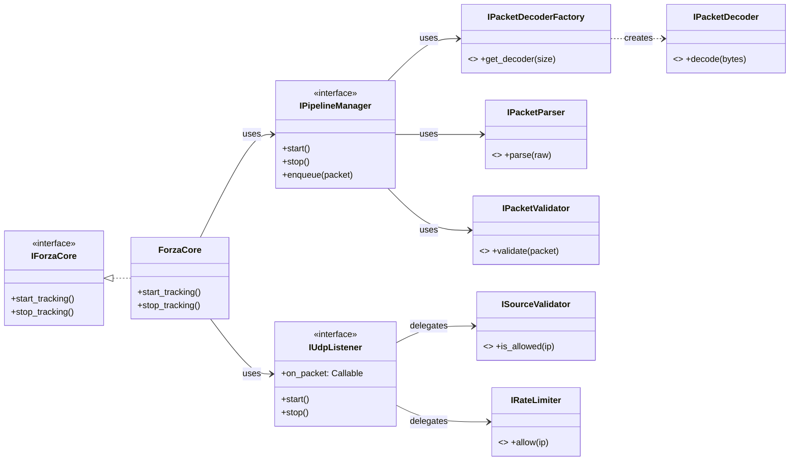

# Core Module Overview

## 🧭 Navigation

Forza Core — модуль приёма и обработки UDP-телеметрии от игры Forza.
Доступен извне через интерфейс **`IForzaCore`**.

> **Словарь терминов:**
> * **Decode** — байты → примитивы (`IPacketDecoder`)
> * **Parse** — примитивы → доменная модель (`IPacketParser`)
> * **Validate** — проверка адекватности данных (`IPacketValidator`)
> * **Drop** — пакет отброшен, каждый drop фиксируется в метриках

---

## Architecture

---

## Документация компонентов

| Компонент | Слой | Описание |
|-----------|------|----------|
| **[ForzaCore](forza_core.md)** | Application | Фасад модуля: жизненный цикл, публичное API, связывание Producer и Consumer |
| **[PipelineManager](pipeline_manager.md)** | Application | Оркестратор пайплайна (Consumer): Decode → Parse → Validate, управление очередями и воркерами |
| **[UdpListener](udp_listener.md)** | Infrastructure | Сетевой I/O (Producer): чтение из сокета, делегирование в `ISourceValidator` и `IRateLimiter`, Timestamping |
| **[Packet Decoder](packet_decoder.md)** | Application | Байты → примитивы. Фабрика `IPacketDecoderFactory` (Registry Pattern) выбирает реализацию по размеру пакета |
| **[Packet Parser](packet_parser.md)** | Domain | Примитивы → доменная модель `TelemetryPacket` (чистый маппинг, без валидации) |
| **[Packet Validator](packet_validator.md)** | Domain | Полная валидация: Sanity Check + бизнес-правила (Chain of Responsibility) |
| **[Execution Model](execution_model.md)** | Infrastructure | Producer-Consumer, async I/O thread + Worker Pool |

---

## Main Cycle & Data Flow

Детали о том, как данные проходят через пайплайн:

* **[Main Cycle](cycle.md)** — Диаграммы, пошаговая обработка, Error Handling & DLQ