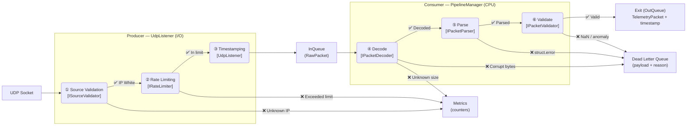
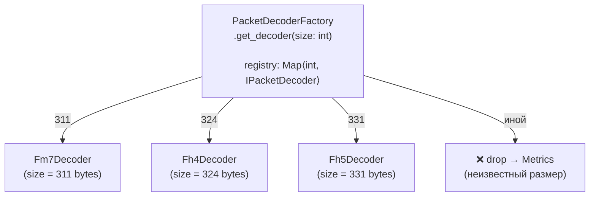
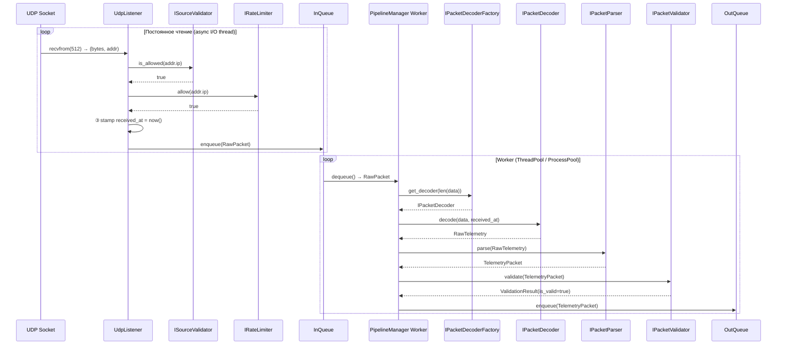
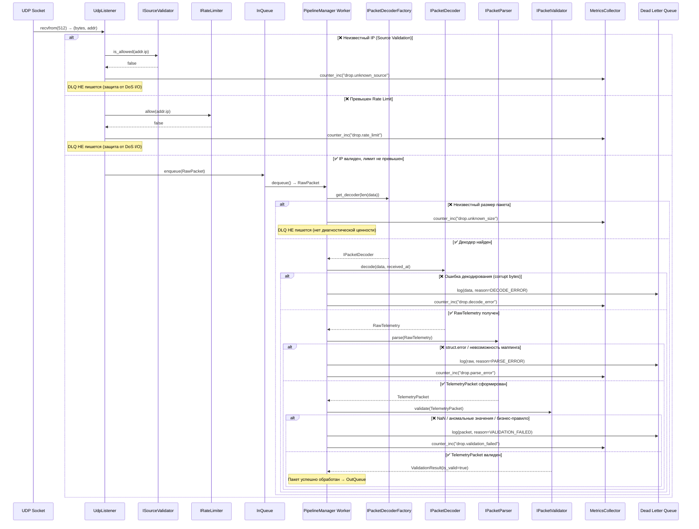

# Cycle of Processing Packets

> **Словарь терминов:**
> * **Decode** — преобразование сырых байт в набор примитивов (float, int). Ответственность `IPacketDecoder`.
> * **Parse** — преобразование набора примитивов в доменную модель (`TelemetryPacket`). Ответственность `IPacketParser`.
> * **Validate** — проверка адекватности данных (NaN, диапазоны, бизнес-правила). Ответственность `IPacketValidator`.
> * **Drop** — пакет отброшен. Каждый drop фиксируется счётчиком метрик.

---

## Core Data Pipeline

Два слоя обработки: **Producer** (I/O) и **Consumer** (бизнес-логика), разделённые неблокирующей очередью.

*Описание шагов:*

| # | Шаг | Компонент | Слой | Обязанность |
|---|-----|-----------|------|-------------|
| ① | Source Validation | `ISourceValidator` | Infrastructure | Отклонить пакеты с неизвестных IP (→ только метрика) |
| ② | Rate Limiting | `IRateLimiter` | Infrastructure | Не пропускать более N пакетов/сек (→ только метрика) |
| ③ | Timestamping | `UdpListener` | Infrastructure | Проставить `received_at` сразу после `recvfrom()` |
| ④ | Decode | `IPacketDecoder` | Application | Байты → примитивы + инъекция `received_at`. Версия Forza через `IPacketDecoderFactory` |
| ⑤ | Parse | `IPacketParser` | Domain | Примитивы → `TelemetryPacket` (чистый маппинг, без валидации) |
| ⑥ | Validate | `IPacketValidator` | Domain | Sanity Check + бизнес-правила (Chain of Responsibility) |

> [!IMPORTANT]
> **Разделение дропов:**
> * Сетевые дропы (①②) → **только метрики** (без DLQ). Защита от DoS на I/O-уровне логирования.
> * Дропы данных (④⑤⑥) → **DLQ с payload + метрики**. Диагностическая ценность для дебага.

---

## IPacketDecoderFactory: Registry Pattern

Фабрика использует реестр (`Map<int, IPacketDecoder>`) для выбора декодера. Добавление нового декодера — регистрация записи, не правка условий (OCP).

---

## Happy Path: Sequence Diagram

Успешный путь прохождения пакета. Обратите внимание на границу между Producer (async I/O) и Consumer (CPU worker).

---

## Error Handling & Dead Letter Queue

Что происходит с каждым типом «плохого» пакета. Сетевые дропы → только метрики. Дропы данных → DLQ + метрики.

> **Ключевой принцип:** сетевые дропы логируются **только в метрики** (защита от DoS на I/O логирования). Payload сохраняется в DLQ **только** для DECODE_ERROR, PARSE_ERROR и VALIDATION_FAILED — то есть там, где нужны данные для дебага.
