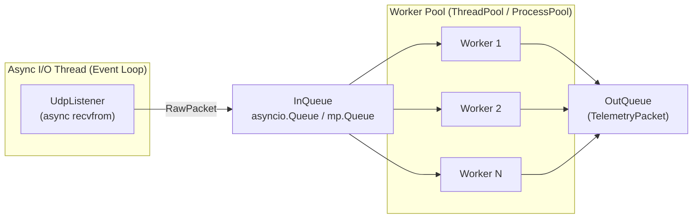
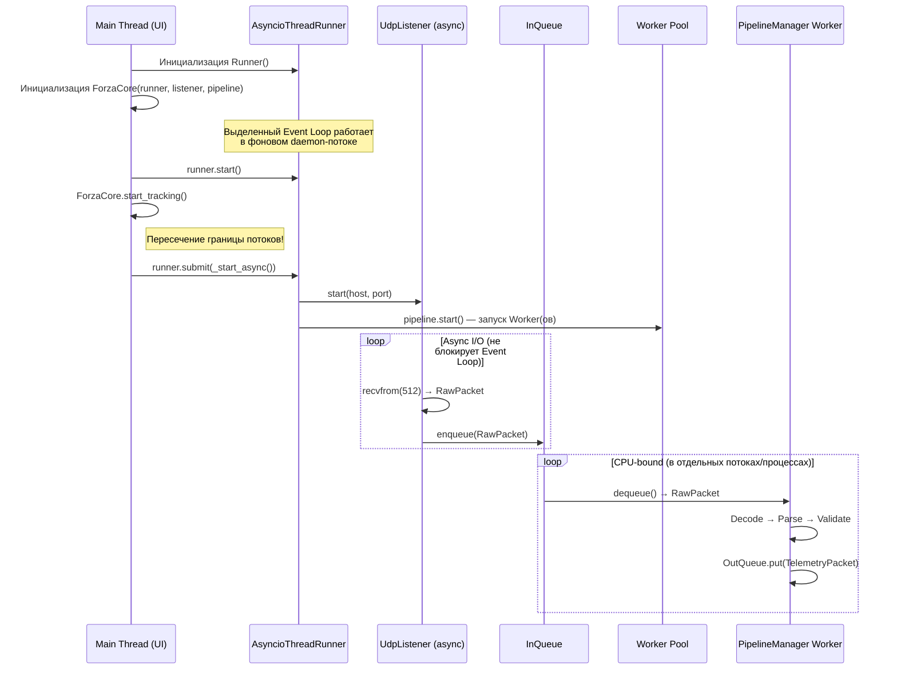

# Execution Model

## Проблема: CPU-bound в Event Loop

Парсинг 80+ float полей (через `struct.unpack`) и маппинг доменных моделей — чистые **CPU-bound** операции. При частоте 60 пакетов/секунду синхронное выполнение декодирования и парсинга в async event loop заблокирует его: буфер UDP-сокета ОС начнёт переполняться, вызывая потерю пакетов (packet loss jitter).

---

## Решение: Producer-Consumer

Сетевой I/O и вычисления **полностью развязаны** через неблокирующую очередь.

| Компонент | Поток | Операции | Блокирует? |
|-----------|-------|----------|:----------:|
| `UdpListener` | Async I/O thread (Event Loop) | `recvfrom()`, Source Validation, Rate Limiting, Timestamping | ❌ (async) |
| `InQueue` | Граница потоков | Буфер `RawPacket` | — |
| `PipelineManager` Worker(s) | `ThreadPoolExecutor` / `ProcessPoolExecutor` | Decode, Parse, Validate | ✅ (CPU, но в своём потоке) |
| `OutQueue` | Граница потоков | Буфер `TelemetryPacket` | — |

## Изолированность потока выполнения

Модуль **не блокирует основной поток** вызывающего приложения (например, UI). Цикл прослушивания UDP-порта работает асинхронно в изолированном фоновом потоке, управляемом через `IAsyncRunner` (реализация `AsyncioThreadRunner`).

* Запуск инфраструктуры потока: `self._async_runner.start()`
* Межпоточное взаимодействие: `self._async_runner.submit(self._start_async())`

## Sequence Diagram

## Выбор Executor

| Executor | Когда использовать | Плюсы | Минусы |
|----------|-------------------|-------|--------|
| `ThreadPoolExecutor` | Лёгкая нагрузка, простые структуры | Общая память, лёгкий запуск | GIL ограничивает CPU-параллелизм |
| `ProcessPoolExecutor` | Высокая нагрузка, обход GIL | Реальный параллелизм | Overhead на сериализацию данных между процессами |

> [!TIP]
> Для начальной реализации достаточно `ThreadPoolExecutor` с 1–2 воркерами.  `struct.unpack` для одного пакета занимает ~10–50 μs — при 60 пкт/с это ~3 мс/с CPU, что не создаёт проблем для ThreadPool. `ProcessPoolExecutor` оправдан при масштабировании до нескольких сотен пакетов/секунду или при добавлении вычислительно тяжёлой валидации.
