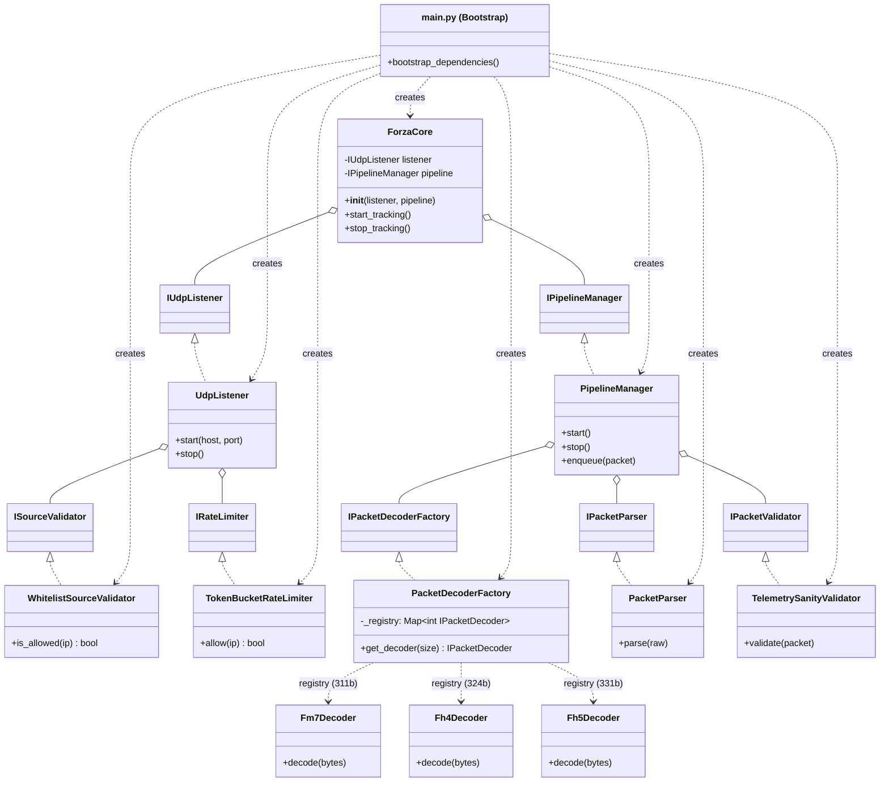
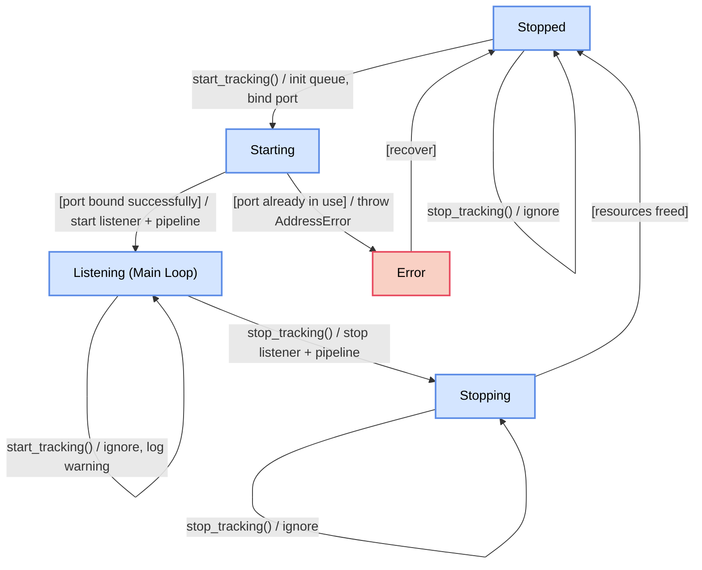

# ForzaCore (Module Facade)

## Суть

`ForzaCore` реализует интерфейс `IForzaCore` и выступает **фасадом модуля**: предоставляет публичное API (`start_tracking`, `stop_tracking`), управляет жизненным циклом и делегирует работу внутренним компонентам. Сам `ForzaCore` не знает ни о UDP, ни о бинарных форматах, ни о порядке шагов пайплайна.

Оркестрация конвейера (Decode → Parse → Validate) вынесена в [PipelineManager](pipeline_manager.md) для соблюдения SRP.

---

## Dependency Injection (Assembly)

Ниже показано, как Composition Root (`main.py`) собирает все компоненты. `ForzaCore` зависит только от интерфейсов и не знает о конкретных реализациях.

Через интерфейсы внутрь `ForzaCore` инжектируются:
* `IUdpListener` — сетевой I/O, Source Validation (делегирует `ISourceValidator`), Rate Limiting (делегирует `IRateLimiter`), Timestamping
* `IPipelineManager` — оркестрация Decode → Parse → Validate, управление очередями и воркерами

`ForzaCore` связывает их: `listener.on_packet = pipeline.enqueue`.

---

## Управление состоянием (Жизненный цикл)

---

## Методы `start_tracking()` и `stop_tracking()`

При вызове `start_tracking()` фасад последовательно:
1. Запускает `pipeline.start()` — инициализирует очереди и воркеры
2. Устанавливает callback: `listener.on_packet = pipeline.enqueue`
3. Запускает `listener.start(host, port)` — начинает чтение из сети

При вызове `stop_tracking()` — в обратном порядке:
1. `listener.stop()` — прекращает чтение
2. `pipeline.stop()` — дожидается обработки оставшейся очереди и останавливает воркеры

* **Идемпотентность**: повторный `start_tracking()` при уже запущенном цикле логирует предупреждение и игнорируется (не вызывает "Port in use"). Аналогично `stop_tracking()` у остановленного модуля.

---

## Execution Model

Подробности асинхронного выполнения, Producer-Consumer паттерна и управления потоками: **[Execution Model](execution_model.md)**
