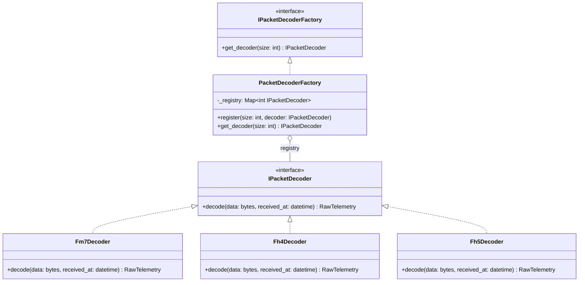

# Packet Decoder

> **Словарь:** **Decode** = байты → набор примитивов (float, int). Это не парсинг и не маппинг доменных объектов.

## Суть

`IPacketDecoder` отвечает исключительно за бинарную распаковку: он берёт массив байт и превращает его в набор типизированных примитивов (`RawTelemetry`). Декодер **ничего не знает** о UDP, сокетах или доменных объектах.

Версия Forza определяется **не внутри декодера**, а снаружи — через `IPacketDecoderFactory`.

## IPacketDecoderFactory: Registry Pattern

Фабрика использует **реестр** (`Map<int, IPacketDecoder>`) вместо `if/switch` для выбора декодера по размеру пакета. Это полностью закрывает класс для модификации (Open/Closed Principle): добавление нового декодера — это регистрация записи, а не правка условий.



### Регистрация декодеров (Composition Root)

```python
factory = PacketDecoderFactory()
factory.register(311, Fm7Decoder())
factory.register(324, Fh4Decoder())
factory.register(331, Fh5Decoder())
```

При вызове `factory.get_decoder(size)`:
* Если `size` найден в реестре → возвращает зарегистрированный `IPacketDecoder`
* Если `size` не найден → возвращает `None` (или бросает `UnknownPacketSizeError`)

### Задел на будущее (YAGNI)

> [!NOTE]
> **Fh6Decoder не создаётся до выхода Forza Horizon 6.** Пока структура пакета неизвестна, проектировать под неё — переинженерия.

Когда FH6 выйдет, возможны два сценария:
* **Другой размер пакета** — добавляем `factory.register(XXX, Fh6Decoder())`, ноль изменений в существующем коде
* **Тот же размер (331 bytes)** — расширяем контракт фабрики: `get_decoder(size: int, header_bytes: bytes, port: int)`. Дискриминатором послужит magic bytes в заголовке или разведение по разным UDP-портам

## Обязанности IPacketDecoder

| Обязанность | Описание |
|-------------|----------|
| **Decode** | Распаковка структуры (`struct.unpack`) в 80+ полей и сохранение `received_at` |
| **Контракт** | Принимает `bytes` и `datetime`, возвращает `RawTelemetry` |

## Что IPacketDecoder НЕ делает

* ❌ Не слушает UDP
* ❌ Не определяет версию Forza (это задача `IPacketDecoderFactory`)
* ❌ Не создаёт доменные объекты (`TelemetryPacket`) — это задача [IPacketParser](packet_parser.md)
* ❌ Не валидирует значения — это задача [IPacketValidator](packet_validator.md)

## Dead Letter Queue

При невозможности декодировать (повреждённые байты) [PipelineManager](pipeline_manager.md) выполняет:
1. Запись в **DLQ** с причиной `DECODE_ERROR` и payload
2. Инкремент метрики `drop.decode_error`

При неизвестном размере пакета — только метрика `drop.unknown_size` (без DLQ, диагностическая ценность payload минимальна).

## В контексте Pipeline

На схеме [Main Cycle](cycle.md) данный компонент — **шаг Decode** внутри [PipelineManager](pipeline_manager.md). Принимает `bytes` из `RawPacket`, передаёт `RawTelemetry` в [IPacketParser](packet_parser.md).