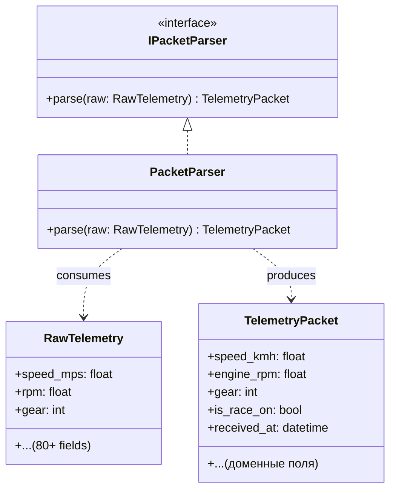

# Packet Parser

> **Словарь:** **Parse** = набор примитивов (`RawTelemetry`) → доменная модель (`TelemetryPacket`). Это не бинарная распаковка байт и не валидация.

## Суть

`IPacketParser` отвечает исключительно за **чистую трансформацию** данных из технического представления (`RawTelemetry`) в доменную модель (`TelemetryPacket`). Парсер переносит поля, конвертирует единицы измерения и формирует DTO — но **не оценивает адекватность данных**.

Если внутри `RawTelemetry` прилетел `NaN` или аномальное значение, парсер честно маппит его в `TelemetryPacket`. Оценка адекватности — обязанность [IPacketValidator](packet_validator.md).

## Диаграмма реализации

## Обязанности

| Обязанность | Описание |
|-------------|----------|
| **Маппинг полей** | Перенос значений из `RawTelemetry` в `TelemetryPacket` |
| **Конвертация единиц** | Например: `m/s → km/h`, нормализация диапазонов |
| **Контракт** | Принимает `RawTelemetry`, возвращает `TelemetryPacket` |

## Что IPacketParser НЕ делает

* ❌ Не проверяет `NaN`, `Inf`, аномальные значения — это задача [IPacketValidator](packet_validator.md)
* ❌ Не работает с байтами напрямую — это задача [IPacketDecoder](packet_decoder.md)
* ❌ Не слушает UDP — это задача [UdpListener](udp_listener.md)
* ❌ Не определяет версию Forza — это задача `IPacketDecoderFactory`

## Исключения

Парсер может выбросить исключение **только** при физической невозможности трансформации:
* Несовпадение типов (ожидали `float`, получили нечто иное)
* `struct.error` при ошибке распаковки вложенных структур

Такие исключения перехватываются [PipelineManager](pipeline_manager.md) и маршрутизируются в DLQ с причиной `PARSE_ERROR`.

> [!NOTE]
> Парсер **не дропает** пакеты самостоятельно. Все решения о приёмке/отклонении данных принимает [IPacketValidator](packet_validator.md).

## В контексте Pipeline

На схеме [Main Cycle](cycle.md) данный компонент — **шаг Parse** внутри [PipelineManager](pipeline_manager.md). Принимает `RawTelemetry` от `IPacketDecoder`, передаёт `TelemetryPacket` в `IPacketValidator`.
