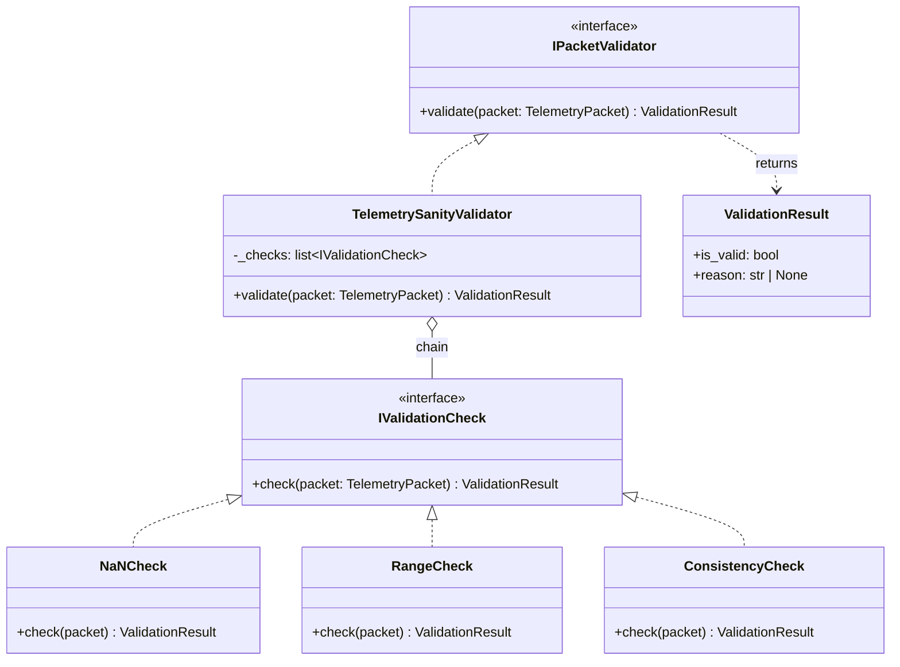

# IPacketValidator

> **Слой:** Domain.
> `IPacketValidator` — единственный компонент, принимающий решение о приёмке или отклонении `TelemetryPacket`.

## Суть

`IPacketValidator` реализует **полную цепочку валидации** (Chain of Responsibility): от базового Sanity Check (NaN, Inf, нереалистичные значения) до сложных бизнес-правил (согласованность полей, диапазоны трека, временны́е рамки).

Парсер ([IPacketParser](packet_parser.md)) выполняет только чистый маппинг и может передать `TelemetryPacket` с `NaN`-полями. Именно `IPacketValidator` отсеивает такие пакеты.

## Диаграмма реализации

## Chain of Responsibility

Валидация выполняется пошагово. При первой неудаче цепочка прерывается и возвращает `ValidationResult(is_valid=False, reason=...)`.

| Порядок | Проверка | Примеры |
|:-------:|----------|---------|
| 1 | **NaN / Inf Check** | `math.isnan(speed)`, `math.isinf(rpm)` |
| 2 | **Range Check** | `0 ≤ rpm ≤ 20_000`, `0 ≤ speed_kmh ≤ 500` |
| 3 | **Consistency Check** | `gear > 0` при `rpm > 0`, согласованность векторов |

Новые проверки добавляются как реализации `IValidationCheck` без модификации `TelemetrySanityValidator` (Open/Closed Principle).

## Обязанности

| Обязанность | Описание |
|-------------|----------|
| **Sanity Check** | Отсев `NaN`, `Inf`, физически невозможных значений |
| **Бизнес-правила** | Согласованность полей, диапазоны, специфика игровых режимов |
| **Контракт** | Принимает `TelemetryPacket`, возвращает `ValidationResult` |

## Что IPacketValidator НЕ делает

* ❌ Не маппит данные — это задача [IPacketParser](packet_parser.md)
* ❌ Не декодирует байты — это задача [IPacketDecoder](packet_decoder.md)
* ❌ Не работает с сетью — это задача [UdpListener](udp_listener.md)

## Dead Letter Queue

При неудачной валидации [PipelineManager](pipeline_manager.md) выполняет:
1. Запись в **DLQ** с причиной `VALIDATION_FAILED` и деталями (`reason`)
2. Инкремент метрики `drop.validation_failed`

> [!NOTE]
> DLQ с payload сохраняется для `VALIDATION_FAILED`, так как данные имеют диагностическую ценность (реальный пакет с аномалиями, полезен для дебага бизнес-логики).

## В контексте Pipeline

На схеме [Main Cycle](cycle.md) данный компонент — **последний шаг** внутри [PipelineManager](pipeline_manager.md). Получает `TelemetryPacket` от `IPacketParser`, при успешной валидации пакет отправляется в `OutQueue`.
