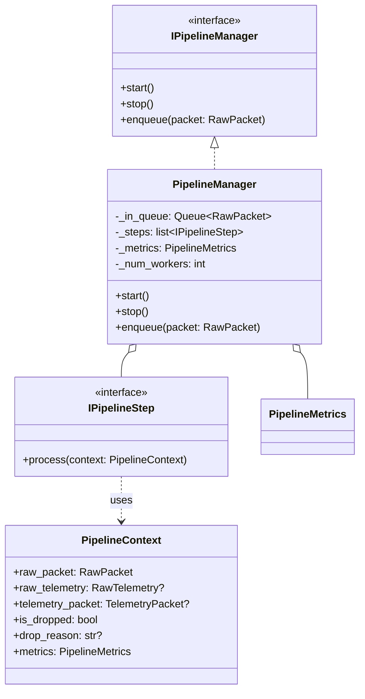

# PipelineManager

> **Слой:** Application.
> PipelineManager — оркестратор пайплайна обработки телеметрии.

## Суть

`PipelineManager` принимает сырые пакеты (`RawPacket`) из внутренней очереди и прогоняет их через расширяемый список шагов (**Middleware**). Каждый шаг реализует интерфейс `IPipelineStep` и работает с общим объектом `PipelineContext`.

Введён для соблюдения SRP и **Open/Closed Principle (OCP)**: теперь добавление новых этапов (фильтрация, обогащение, кэширование) не требует изменения кода `PipelineManager`.

## Диаграмма реализации



## Pipeline Context Flow

```
UdpListener ──(RawPacket)──▶ [InQueue] ──▶ Worker(s)
                                              │
                                     [PipelineContext]
                                              │
                    Step 1 (Decode) → Step 2 (Parse) → Step 3 (Validate) → ...
                                              │
                                     [OutQueue] (Dispatch)
```

* **Producer:** `UdpListener` вызывает `pipeline_manager.enqueue(raw_packet)` через callback `on_packet`
* **Consumer:** Worker(ы) создают `PipelineContext` и последовательно вызывают `step.process(context)`.
* **Flow Control:** Если любой шаг устанавливает `context.is_dropped = True`, выполнение цепочки для этого пакета прекращается.

## Обязанности

| Обязанность | Описание |
|-------------|----------|
| **Оркестрация** | Последовательный вызов списка `IPipelineStep` |
| **Буферизация** | Управление `InQueue` между Producer и Consumer |
| **Concurrency** | Запуск Worker(ов) в `ThreadPoolExecutor` |
| **Centralized DLQ** | Маршрутизация ошибок в DLQ на основе состояния контекста после прохождения шагов |
| **Metrics State** | Владение объектом `PipelineMetrics` для агрегации статистики |

## Что PipelineManager НЕ делает

* ❌ Не знает конкретных шагов (Decode/Parse/Validate) — они инжектируются как список.
* ❌ Не реализует бизнес-логику — делегирует её реализациям `IPipelineStep`.
* ❌ Не работает с сетью — это задача [UdpListener](udp_listener.md).

## Dead Letter Queue

`PipelineManager` централизованно проверяет контекст после завершения (или прерывания) цепочки шагов:

| Этап (Step) | Причина (Reason) | DLQ (payload) | Метрика |
|------|---------|:-------------:|---------|
| DecodingStep | `UNKNOWN_SIZE` | ❌ | `drop.unknown_size` |
| DecodingStep | `DECODE_ERROR` | ✅ `Raw packet` | `drop.decode_error` |
| ParsingStep | `PARSE_ERROR` | ✅ `RawTelemetry` | `drop.parse_error` |
| ValidationStep | `VALIDATION_FAILED` | ✅ `TelemetryPacket` | `drop.validation_failed` |

> [!TIP]
> Благодаря внедрению `PipelineContext`, новые шаги могут добавлять свои специфичные причины дропа и детали ошибок, которые `PipelineManager` автоматически подхватит для логирования в DLQ.

## В контексте Pipeline

На схеме [Main Cycle](cycle.md) данный компонент — **Consumer**, исполняющий гибкий конвейер обработки.
