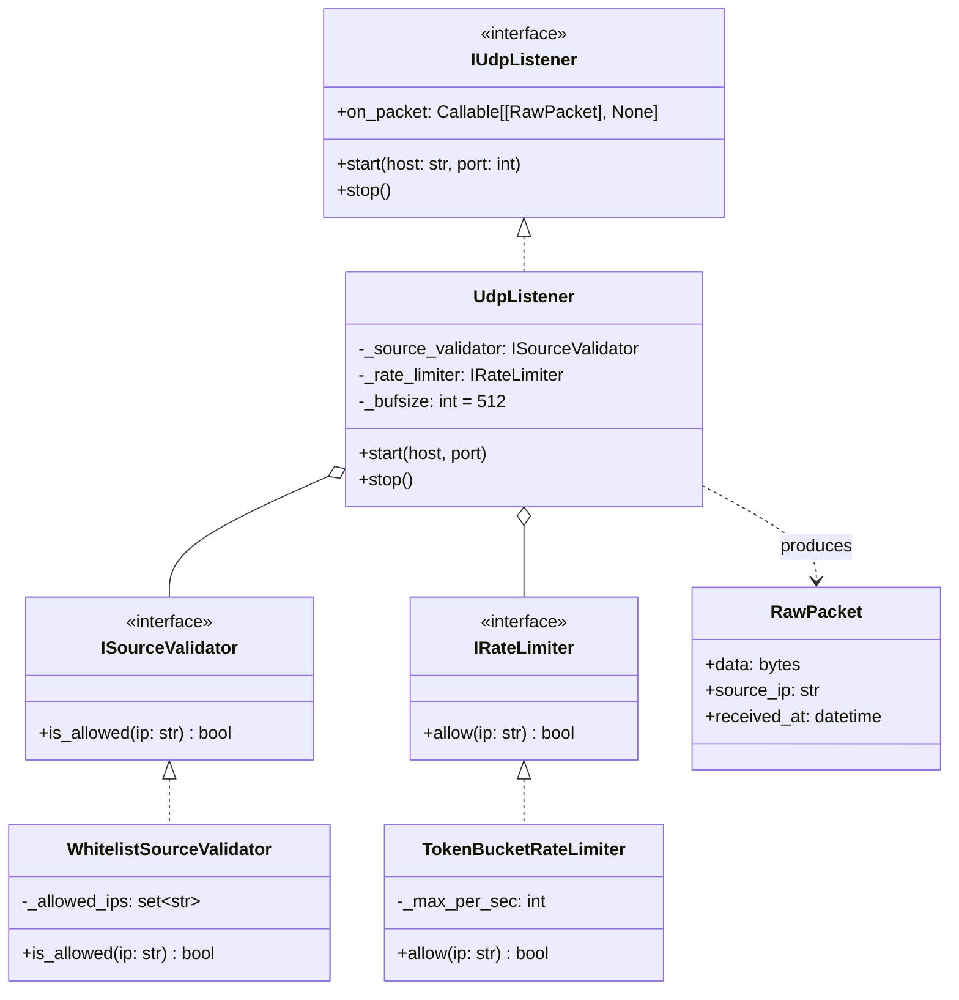

# UdpListener

> **Слой:** Infrastructure (не Domain / Application).
> UdpListener — единственный компонент, который знает о существовании сети.

## Суть

`UdpListener` — тонкий сетевой **Producer**. Его единственная задача — читать байты из UDP-сокета и передавать их дальше через callback `on_packet`. Он **не интерпретирует содержимое** и **не оркестрирует пайплайн**.

Проверка источника и ограничение частоты делегируются внедрённым middleware-классам: `ISourceValidator` и `IRateLimiter`.

## Диаграмма реализации



## Обязанности

| Обязанность | Описание |
|-------------|----------|
| **Получение данных** | `recvfrom(512)` на UDP-сокете в цикле (см. [Размер буфера](#размер-буфера-recvfrom)) |
| **Source Validation** | Делегирование: `if not self._source_validator.is_allowed(ip): return` |
| **Rate Limiting** | Делегирование: `if not self._rate_limiter.allow(ip): return` |
| **Timestamping** | `received_at = datetime.now(UTC)` **сразу** после `recvfrom()`, до любой обработки |
| **Передача дальше** | Вызов `on_packet(RawPacket)` — единственный выход из компонента |

## Что UdpListener НЕ делает

* ❌ Не интерпретирует содержимое байт
* ❌ Не определяет версию Forza
* ❌ Не создаёт доменные объекты
* ❌ Не вызывает Decoder, Parser или Validator — оркестрация принадлежит [PipelineManager](pipeline_manager.md)

## Middleware: SourceValidator и RateLimiter

`UdpListener` не реализует логику проверок самостоятельно. Вместо этого он делегирует её внедрённым middleware-классам:

* **`ISourceValidator`** — проверка IP-адреса отправителя по правилу (белый список, подсеть и т.д.)
* **`IRateLimiter`** — ограничение частоты пакетов. Начальная реализация — простой счётчик; при необходимости заменяется на Token Bucket без изменения `UdpListener`

Такая декомпозиция позволяет:
1. Тестировать каждый middleware изолированно
2. Заменять реализации (например, `WhitelistValidator` → `SubnetValidator`) без правок в `UdpListener`
3. Избежать разрастания `UdpListener` при усложнении логики

## Размер буфера `recvfrom()`

> [!IMPORTANT]
> **Максимальный размер валидного пакета Forza — 331 байт.** Буфер чтения ограничен `512` байтами.

```python
data, addr = sock.recvfrom(512)  # max valid = 331, ceiling = 512
```

**Обоснование:** UDP позволяет отправить пакет до ~64 KB. Без ограничения буфера злоумышленник (или баг) может вызвать аллокацию крупных пакетов **до** срабатывания Rate Limiter, что приведёт к исчерпанию памяти (OOM). Буфер `512` — ближайшая степень двойки выше `331`, которая гарантирует приём любого валидного пакета и автоматическое усечение oversized данных на уровне ОС.

## Ограничения безопасности

> [!WARNING]
> **Source Validation не защищает от IP-spoofing внутри LAN.**

UDP не гарантирует подлинность `source_ip`. Злоумышленник в локальной сети может подделать IP-адрес из белого списка. Поэтому:

* **Rate Limiter применяется даже для валидных IP** — это ограничивает ущерб от spoofing-атаки
* Для защиты в доверенной LAN текущего уровня достаточно
* Данное ограничение зафиксировано явно, а не подразумевается

## Политика дропов: только метрики

> [!NOTE]
> Сетевые дропы (`UNKNOWN_SOURCE`, `RATE_LIMIT_EXCEEDED`) **не пишутся в DLQ**. Логируются только счётчики метрик.

| Событие | Действие |
|---------|----------|
| ❌ Unknown IP | `metrics.inc("drop.unknown_source")` |
| ❌ Rate Limit | `metrics.inc("drop.rate_limit")` |

**Обоснование:** При DoS-атаке (10,000+ пкт/с) запись каждого дропа в DLQ (диск I/O) положит приложение быстрее, чем сама атака. Payload сетевых дропов не несёт диагностической ценности — достаточно знать *сколько* пакетов отброшено, а не *каких*.

Полный payload сохраняется в DLQ только для `DECODE_ERROR` и `VALIDATION_FAILED` — см. [Packet Decoder](packet_decoder.md) и [Packet Validator](packet_validator.md).

## В контексте Pipeline

На схеме [Main Cycle](cycle.md) данный компонент является **Producer**: читает из сети и пушит `RawPacket` в очередь [PipelineManager](pipeline_manager.md).
